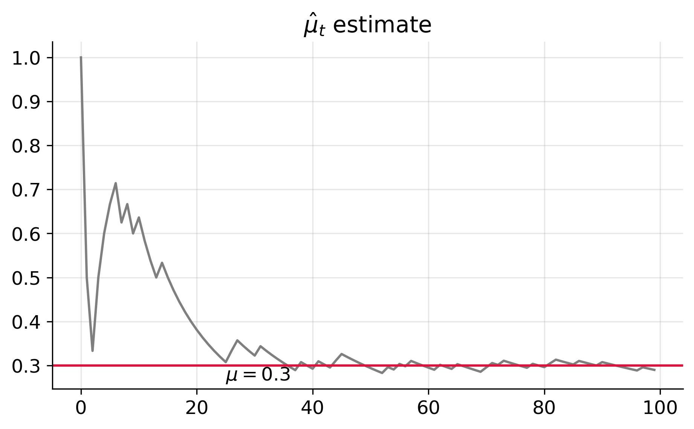
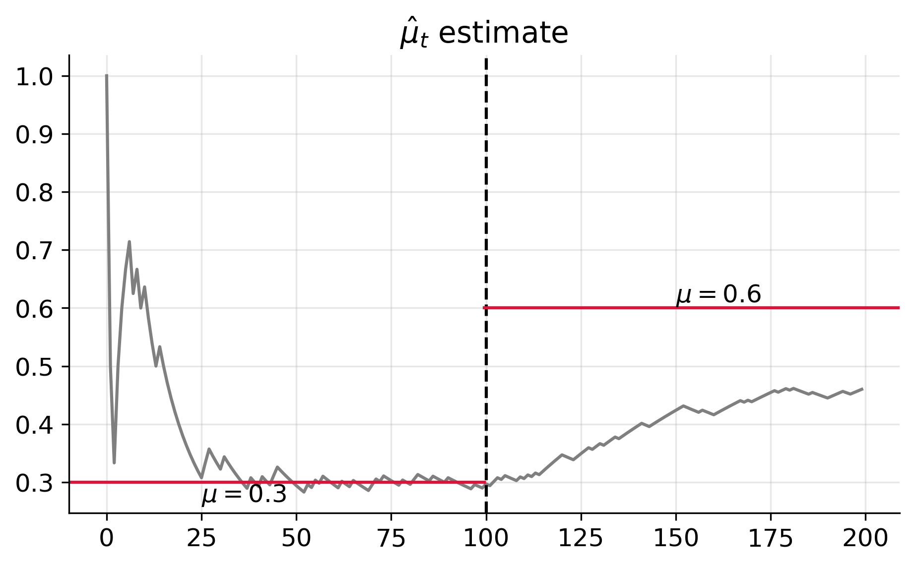
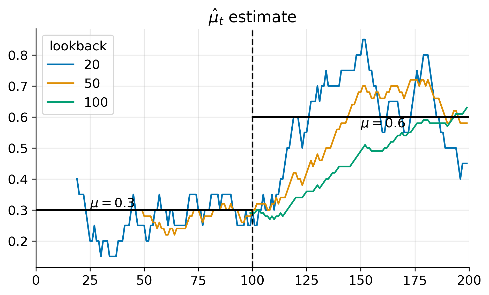
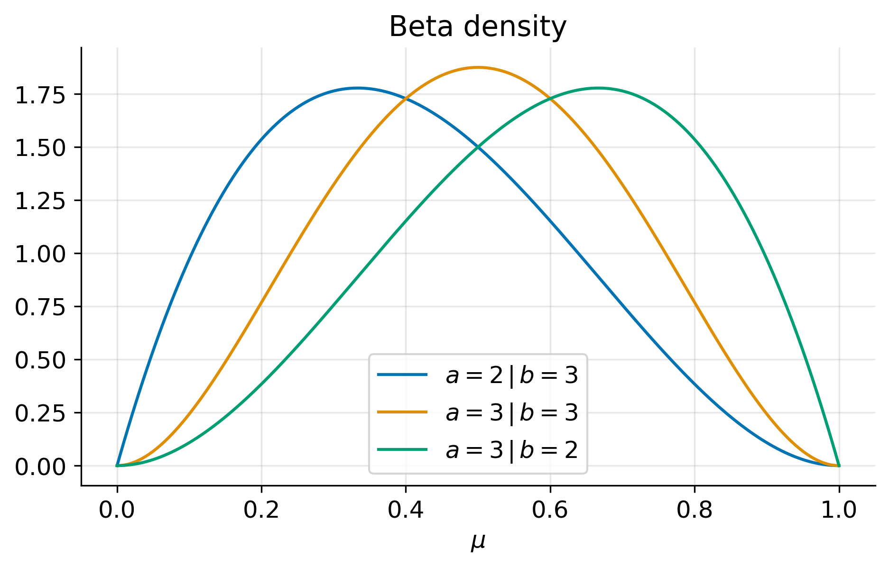
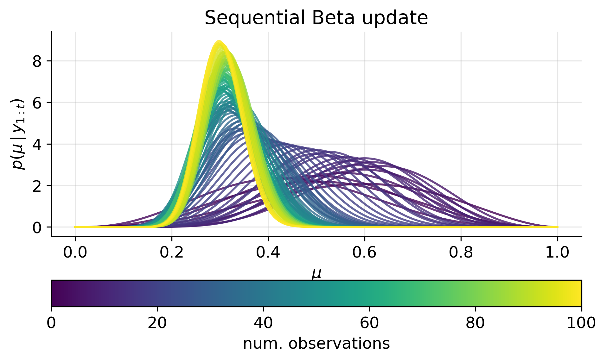
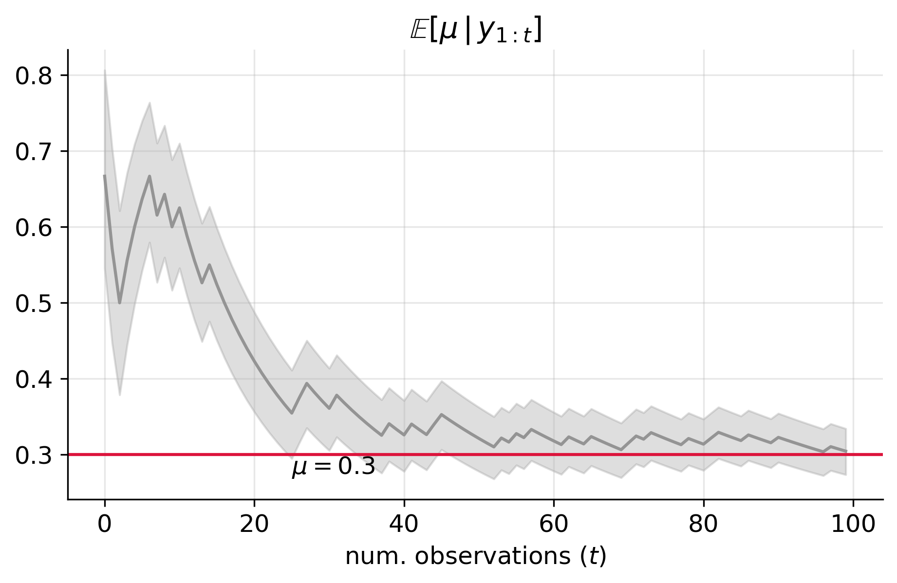
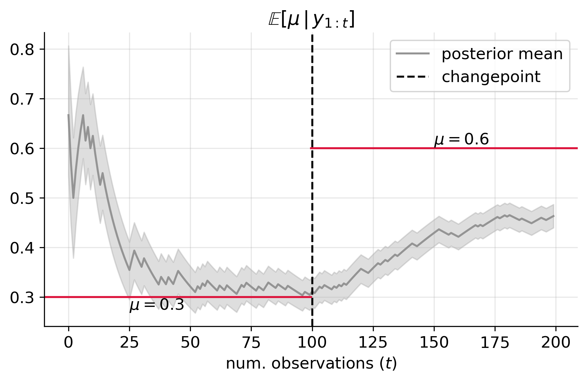
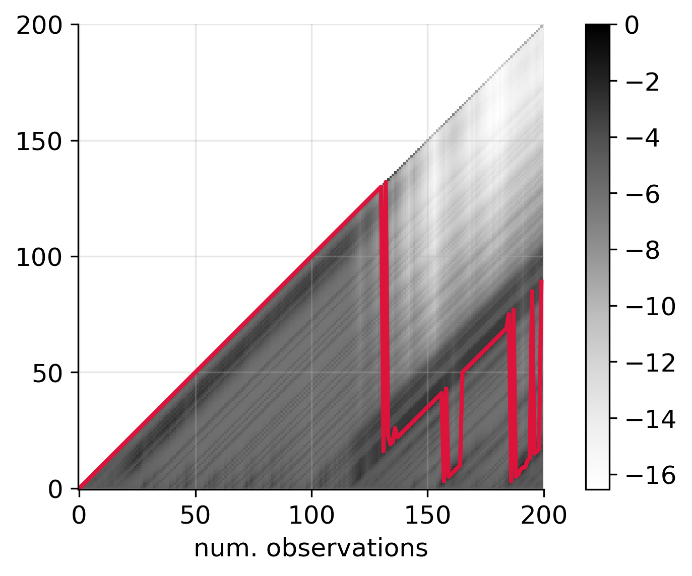
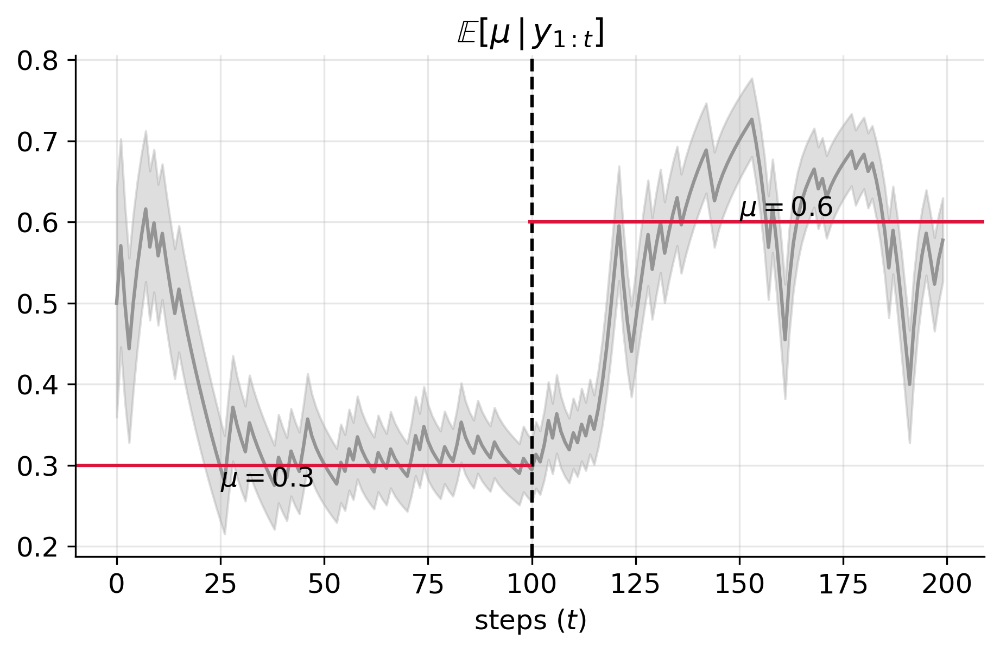

# Introduction
In a world where conditions constantly change, how can we accurately predict outcomes?


## Flipping coins with fixed probability
Suppose the following sequence of coin tosses arrive in a stream:
```
1, 0, 0, 1, 1, 1, 1, 0, 1, 0, 1, 0, 0, 0, 1, 0, 0, 0, 0, 0, 0, 0,
0, 0, 0, 0, 1, 1, 0, 0, 0, 1, 0, 0, 0, 0, 0, 0, 1, 0, 0, 1, 0, 0,
1, 1, 0, 0, 0, 0, 0, 0, 0, 1, 0, 1, 0, 1, 0, 0, 0, 0, 1, 0, 0, 1,
0, 0, 0, 0, 1, 1, 0, 1, 0, 0, 0, 0, 1, 0, 0, 1, 1, 0, 0, 0, 1, 0,
0, 0, 1, 0, 0, 0, 0, 0, 0, 1, 0, 0
```
Here, `1` corresponds to heads and `0` corresponds to tails.

We want to estimate the probability of getting heads as we flip the coins.
A straightforward method is to count the number of heads that have appeared so far, divided by the total number of flips.

Mathematically, denote the sequence of flips by
$y_{1:t} = (y_1, \ldots, y_T)$, with
$y_t\in\{0, 1\}$ for $t = 1, \ldots, T$, and
$T$ is the length of the sequence.
The estimated probability of a heads after $t$ flips is given by

$$
    \hat{\mu}_t = \frac{1}{t}\sum_{k=1}^t \mathbb{1}(y_k = 1).
$$


The figure below shows the estimated probability of heads as a function of the flips shown above:

We observe that the strategy above correctly estimates the probability of a heads

This method works well when each coin flip is independent and identically distributed (i.i.d.).
But what happens when the odds change midstream?

## Non-starionary coin flipping: when the rules change
In many real-world scenarios, the assumption of i.i.d. doesn't hold.
For example, consider the following sequence of 200 coin flips.
In the first 100 flips, the probability of heads is `0.3`,
while in the last 100 flips, the probability increases to `0.6`:
```
1, 0, 0, 1, 1, 1, 1, 0, 1, 0, 1, 0, 0, 0, 1, 0, 0, 0, 0, 0, 0, 0,
0, 0, 0, 0, 1, 1, 0, 0, 0, 1, 0, 0, 0, 0, 0, 0, 1, 0, 0, 1, 0, 0,
1, 1, 0, 0, 0, 0, 0, 0, 0, 1, 0, 1, 0, 1, 0, 0, 0, 0, 1, 0, 0, 1,
0, 0, 0, 0, 1, 1, 0, 1, 0, 0, 0, 0, 1, 0, 0, 1, 1, 0, 0, 0, 1, 0,
0, 0, 1, 0, 0, 0, 0, 0, 0, 1, 0, 0, 1, 0, 1, 1, 0, 1, 0, 0, 0, 1,
0, 1, 0, 1, 0, 1, 1, 1, 1, 1, 1, 0, 0, 0, 1, 1, 1, 1, 0, 1, 1, 0,
1, 1, 1, 0, 1, 1, 1, 1, 1, 1, 0, 0, 1, 1, 1, 1, 1, 1, 1, 1, 1, 0,
0, 0, 0, 1, 0, 0, 0, 1, 1, 1, 1, 1, 1, 1, 0, 1, 0, 1, 1, 1, 1, 1,
1, 0, 1, 1, 0, 1, 0, 0, 0, 0, 1, 0, 0, 0, 0, 1, 1, 1, 1, 0, 0, 1,
1, 1
```

The figure below shows the estimate of heads using the simple counting formula:

Here, we see that while the method correctly estimates the probability for the first 100 flips,
it fails to capture the shift in the second set of flips.
This highlights a crucial limitation — static methods struggle when dealing with dynamic, non-stationary data.


### The rolling-mean strategy: adapting to a change
To address the non-stationarity in the data,
we can reduce the amount of data we consider for estimating the probability of heads.
One approach is to use a _rolling mean_, where we only look at the most recent flips.


In this case, the estimate of the probability becomes:  

$$
    \hat{\mu}_t^{(\ell)} = \frac{1}{\ell}\sum_{k=1}^{\ell} y_{t - k},
$$

for $t \geq \ell$.
Here, $\ell$ represents the _lookback_ or _runlength_.


The figure below shows the rolling mean estimate of the flips for various levels of lookback $\ell$:


Notice how different lookbacks estimate the true probability of `0.6` at $t \geq 100$ differently. For instance:
- $\ell = 20$ is closest to the true probability at $t = 120$;
- $\ell = 50$ is closest at $t = 150$;
- $\ell = 100$ is closest at $t = 200$.

This observation aligns with our intuition that $\ell$ reflects the number of timesteps in the current regime.
However, as the example shows, picking the right lookback window can be tricky.
What if there was a way to automatically adapt this lookback as the data evolves?


### Rolling means, regime changes, and Bayes: enter the BOCD

As we've seen, the optimal lookback $\ell$ shifts as time $t$ progresses.
This raises a critical question: At any given time $t$, how do we determine the _best_ lookback period?
Here, the _best_ lookback is the one that most accurately reflects the probability of heads in the current regime.

This is where the Bayesian Online Changepoint Detection (BOCD) algorithm comes into play.
As we will see,
BOCD works by weighting different lookbacks according to their probability,
allowing it to detect changes in real time and dynamically adjust predictions.
This real-time adaptability is essential for making accurate predictions in rapidly changing environments.

To fully understand how BOCD operates, especially in the context of binary data, we need to lay some groundwork.
In the following section, we'll explore key concepts in Bayesian inference, such as
conjugate priors, probability distributions, and how these ideas come together to form the foundation of the BOCD algorithm.

---

# The Bayesian perspective

In this section, we'll revisit the problem of estimating the probability of heads using a Bayesian approach.
Unlike the frequentist method, which provides a single point estimate (e.g., $\mu = 0.3$),
the Bayesian approach offers a probability distribution over possible values of $\mu$.
This distribution gives us a richer understanding of our uncertainty about the true probability of heads.

The core idea is that instead of estimating $\mu$ as a single number,
we compute a posterior density over $\mu$,
which represents our updated beliefs about the probability of heads after observing $t$ coin flips.
To compute this posterior, we need two key components: the prior and the likelihood.

### The Prior Density

The prior density reflects our beliefs about the probability of heads before we observe any data.
A natural choice for this prior is the Beta distribution,
which is defined on the interval $(0,1)$, the same interval in which $\mu$ lies.
The Beta distribution is also convenient because it is conjugate to the Bernoulli likelihood,
meaning it simplifies the math when we update our beliefs.
We will come back to this point below.

The Beta density is defined as:

$$
\tag{2}
    \text{Beta}(\mu\,|\,a,b) = \frac{\Gamma(a)\,\Gamma(b)}{\Gamma(a + b)} \mu^{a-1}(1-\mu)^{b-1}
$$

where $\Gamma(z)$ is the gamma function and $a, b > 0$ are shape parameters that control the skewness of the distribution.

The following figure shows the probability density function (pdf) of the Beta distribution for different values of $a$ and $b$.


Notice how the shape of the distribution changes based on the relationship between $a$ and $b$:
- When $a > b$, the density is skewed toward 1 (indicating a higher belief in heads).
- When $a < b$, the density is skewed toward 0 (indicating a higher belief in tails).
- When $a = b$, the density is symmetric, indicating equal probability for heads and tails.

In the special case where $a = b$,
the magnitude of $a$ and $b$ reflects how confident we are in this assumption of equal probability.
Larger values of $a$ and $b$ correspond to stronger prior beliefs,
meaning we are more certain that the true probability of heads and tails is close to 0.5.
Conversely, smaller values of $a$ and $b$ indicate weaker prior beliefs, implying more uncertainty around this assumption.


### The Likelihood

The likelihood represents the process by which the coin flips are generated.
 For this problem, the natural choice is the Bernoulli mass function,
 which takes the form

$$
\tag{1}
    p(y\,\vert\,\mu) = \mu^y\,(1 - \mu)^{1 - y}.
$$

Here, $\mu \in (0,1)$ is the probability of heads, and $y$ is the outcome of a single flip (1 for heads, 0 for tails).


### The Posterior Density

With both the prior and likelihood in hand,a we can now compute the posterior density,
which represents our updated beliefs about $\mu$ after observing $t$ coin flips ($y_{1:t}$).
This posterior distribution reflects how our beliefs about $\mu$ evolve as we observe more data,
continuously updating our uncertainty about the true probability of heads.

In general, the posterior density is proportional to the product of the prior and the likelihood:

$$
    p(\mu\,\vert\,y_{1:t}) \propto p(\mu)\,p(y_{1:t}\,\vert\,\mu).
$$


The symbol $\propto$ denotes proportionality, i.e., $f(x) \propto g(x)$ means that
$f(x) = c\,g(x)$
for some constant $c$ that does not depend on $x$.
In Bayesian inference,
this constant $c$ is typically found by normalizing the posterior so that it integrates to 1, ensuring it's a valid probability density.

By multiplying the prior and likelihood, we obtain a posterior distribution for $\mu$.
Conveniently, because we're using a Beta prior and Bernoulli likelihood, the resulting posterior is also a Beta distribution.
This conjugate relationship simplifies the math and makes it easy to update our beliefs as we observe more coin flips.


## Sequential Bayesian Update
Now that we've introduced the posterior density, we turn our attention to updating the posterior sequentially as we observe new data.
Since coin flips are independent and arrive in a stream,
the Bayesian approach allows us to update our beliefs step by step as new flips are observed.

To do this, suppose that our prior is Beta with parameters $a_0$ and $b_0$, so that:

$$
    p(\mu) = \text{Beta}(\mu\,|\,a_0, b_0).
$$


Then, by Bayes' rule, the posterior density of $\mu$ after observing $y_1$ is given by:

$$
\begin{aligned}
    p(\mu\,|\,y_1)
    &\propto p(y_1\,|\,\mu)\,p(\mu) \\
    &= {\rm Bern}(y_1\,|\,\mu)\,{\rm Beta}(\mu\,|\,a_0, b_0) \\
    &\propto \mu^{y_1}(1-\mu)^{1-y_1}\,\mu^{a_0-1}(1-\mu)^{b_0-1} \\
    &= \mu^{y_1 + a_0 - 1}(1-\mu)^{1-y_1 + b_0 - 1} \\
    &\propto \text{Beta}(\mu\,|\,a_1, b_1).
\end{aligned}
$$


with $a_1 = y_1 + a_0$ and $b_1 = 1 - y_1 + b_0$. 

From the above, we see that the posterior density of $\mu$ after observing $y_1$ is a Beta density with parameters $a_1$ and $b_1$.
This is a general property of the Beta-Bernoulli model, known as **conjugacy**.

Following the same reasoning, we can compute the posterior density of $\mu$, having $p(\mu\,|\,y_1)$ as the prior, after observing $y_2$:

$$
\begin{aligned}
    p(\mu\,|\,y_1, y_2)
    &\propto p(\mu\,|\,y_1)\,p(y_2\,|\,\mu, y_1) \\
    &= p(\mu\,|\,y_1)\,p(y_2\,|\,\mu) \\
    &\propto \mu^{a_1-1}(1-\mu)^{b_1-1}\,\mu^{y_2}(1-\mu)^{1-y_2} \\
    &= \mu^{a_1 + y_2 - 1}(1-\mu)^{b_1 + 1 - y_2 - 1} \\
    &\propto \text{Beta}(\mu\,|\,a_2, b_2).
\end{aligned}
$$


with $a_2 = a_1 + y_2$ and $b_2 = b_1 + 1 - y_2$.

In general, having a Beta prior at time $t-1$ with parameters $a_{t-1}$ and $b_{t-1}$,
the posterior density at time $t$ is Beta with parameters:
$$
a_t = a_{t-1} + y_t \quad \text{and} \quad b_t = b_{t-1} + 1 - y_t.
$$
Explicitly, the posterior density at time $t$ is given by:

$$
\tag{3}
\begin{aligned}
    p(\mu\,|\,y_{1:t})
    &= p(\mu\,|\,y_{1: t-1})\,p(y_t\,|\,\mu) \\
    &= \text{Beta}(\mu\,|\,a_t, b_t).
\end{aligned}
$$

with $a_t = a_{t-1} + y_t$ and $b_t = b_{t-1} + 1 - y_t$. Here, $y_{1:0} = \emptyset$.

To see this process in action, consider the following
simple Python implementation of the sequential Bayesian update for the Beta-Bernoulli model below.
This implementation allows us to update our beliefs about $\mu$ as new coin flips are observed in a data stream.

```python
def beta_update(a, b, y):
    a_new = a + y
    b_new = b + 1 - y
    return a_new, b_new
```

## An example: flipping coins with fixed probability
Let's explore the idea of sequential Bayesian updates with a practical example.
Suppose we observe the following sequence of coin tosses,
where the true (but unknown) probability of heads is fixed at 0.3:
```
1, 0, 0, 1, 1, 1, 1, 0, 1, 0, 1, 0, 0, 0, 1, 0, 0, 0, 0, 0, 0, 0,
0, 0, 0, 0, 1, 1, 0, 0, 0, 1, 0, 0, 0, 0, 0, 0, 1, 0, 0, 1, 0, 0,
1, 1, 0, 0, 0, 0, 0, 0, 0, 1, 0, 1, 0, 1, 0, 0, 0, 0, 1, 0, 0, 1,
0, 0, 0, 0, 1, 1, 0, 1, 0, 0, 0, 0, 1, 0, 0, 1, 1, 0, 0, 0, 1, 0,
0, 0, 1, 0, 0, 0, 0, 0, 0, 1, 0, 0
```


For this example,
we assume that the prior distribution for the probability of heads is a Beta distribution with parameters
$a_0 = b_0 = 3$.
This corresponds to a prior mean of $0.5$ and a 95\% credible interval of approximately $[0.15, 0.85]$.
This prior reflects an initial belief that the coin is likely fair (with a probability of heads around 0.5),
but we are quite uncertain, allowing for a wide range of possible values.

With the prior now specified,
we can proceed to apply the sequential Bayesian update using equation $(3)$,
allowing us to refine our belief about the probability of heads with each new observation.
The following figure illustrates how the posterior density of $\mu$ evolves as a function of the number of coin flips.

As we observe more coin flips, the posterior density becomes more concentrated around a specific value,
and its variance decreases.
This reflects the fact that as more data is gathered,
we become more confident in our estimate of $\mu$.
In this case, the posterior mode converges to a value close to $0.3$, which is the true probability of heads.

We can also compute the *expected posterior probability* of heads. This is given by:

$$
\begin{aligned}
    \mathbb{E}[\mu\,|\,y_{1:t}]
    &= \int \mu\,p(\mu\,|\,y_{1:t})\,d\mu\\
    &= \frac{a_t}{a_t + b_t}.
\end{aligned}
$$


The following figure shows the expected posterior probability of heads (`1`)
as a function of the number of observations,
with the error bounds representing the 50% credible interval
(the Bayesian counterpart to the confidence interval). 

We observe that the expected posterior probability of heads converges to around $0.3$,
indicating that the coin is biased toward tails (`0`).
Additionally, as more observations are made,
the uncertainty around this estimate decreases, as shown by the narrowing credible interval.

## What if the Probability Changes? — When (iid) Bayesian Inference Fails
In real-world scenarios, it's common for underlying probabilities to change over time.
In real-world scenarios, it's common for underlying probabilities to change over time.
For instance, suppose the probability of heads is $p_1$ for the first 100 tosses and then changes to $p_2$ for the remaining tosses.
This shift in probability is known as a *changepoint*,
and the first toss with a probability of heads of $p_1$ marks the moment when the change occurs.


At first glance, it might seem intuitive that by using the Bayesian update process, we could sequentially observe the data, detect the changepoint, and adapt our beliefs accordingly. However, this assumption leads to incorrect conclusions when using the Beta-Bernoulli (BB) model.

The issue lies in two key assumptions of the BB-model:

1. **Constant Probability**: The BB-model assumes that the probability of heads, $\mu$, is unknown but constant throughout the entire sequence. It does not account for any changes in the underlying process.
2. **Equal Weighting of Observations**: The Bayesian update process in the BB-model computes the posterior by summing the prior and all observations equally, regardless of whether a changepoint has occurred. This means the model will continue averaging observations from both before and after the changepoint, without distinguishing between them.

To see an example of this limitation, consider the following sequence of coin tosses, where the first 100 flips have a probability of heads $0.3$, and the last 100 flips have a probability of heads $0.6$:  
```
1, 0, 0, 1, 1, 1, 1, 0, 1, 0, 1, 0, 0, 0, 1, 0, 0, 0, 0, 0, 0, 0,
0, 0, 0, 0, 1, 1, 0, 0, 0, 1, 0, 0, 0, 0, 0, 0, 1, 0, 0, 1, 0, 0,
1, 1, 0, 0, 0, 0, 0, 0, 0, 1, 0, 1, 0, 1, 0, 0, 0, 0, 1, 0, 0, 1,
0, 0, 0, 0, 1, 1, 0, 1, 0, 0, 0, 0, 1, 0, 0, 1, 1, 0, 0, 0, 1, 0,
0, 0, 1, 0, 0, 0, 0, 0, 0, 1, 0, 0, 1, 0, 1, 1, 0, 1, 0, 0, 0, 1,
0, 1, 0, 1, 0, 1, 1, 1, 1, 1, 1, 0, 0, 0, 1, 1, 1, 1, 0, 1, 1, 0,
1, 1, 1, 0, 1, 1, 1, 1, 1, 1, 0, 0, 1, 1, 1, 1, 1, 1, 1, 1, 1, 0,
0, 0, 0, 1, 0, 0, 0, 1, 1, 1, 1, 1, 1, 1, 0, 1, 0, 1, 1, 1, 1, 1,
1, 0, 1, 1, 0, 1, 0, 0, 0, 0, 1, 0, 0, 0, 0, 1, 1, 1, 1, 0, 0, 1,
1, 1
```

The following figure shows the expected value of $\mu$ (the posterior mean) as a function of the number of observations. The dashed line indicates the changepoint, where the probability of heads shifts from $0.3$ to $0.6$:


As expected, the posterior mean of $\mu$ continues to update after the changepoint, but it fails to reflect the true change in the underlying probability. This happens because the Beta-Bernoulli model continues to average all observations, smoothing over the changepoint. While the uncertainty of the estimate decreases with more observations, the model never fully adapts to the new probability.

Does this mean that Bayesian inference is not useful in non-stationary environments? Not necessarily. What this example shows is that, under the assumption of an iid model, Bayesian inference using conjugate models cannot detect changes in the underlying probability.


An important takeaway from the plot above is that the posterior mean closely mirrors the cumulative mean we previously discussed. In fact, when $a_0 = b_0 = 1$, the expected posterior probability matches the cumulative mean exactly.

We’ve seen that one key strength of the Bayesian approach is its ability to treat variables probabilistically,
continuously adapting as new data arrives.
We also explored how rolling time windows can address non-stationarity.
Now, imagine combining the adaptability of Bayesian inference with the flexibility of rolling windows.

To achieve this, we extend our space of random variables to include the lookback period.
This extension allows us to either dynamically select the optimal lookback window or average across multiple windows,
weighted by their probabilities.

The result is the Bayesian Online Changepoint Detection (BOCD) algorithm.
In the next section, we’ll dive deeper into BOCD,
formalizing these ideas and showing how they come together mathematically.

---

# The Bayesian Online Changepoint Detection (BOCD) for a Bernoulli-Beta model: adaptive lookback windows
Following the above reasoning, if we knew the position of the changepoint,
we could simply reset our posterior parameters at the changepoint and
continue updating our beliefs using the new incoming data.
However, in reality, 
we do not know when and if a changepoint occurs.

One way to adapt to non-stationary regime changes 
is to compute the posterior density of $\mu$ at each time step
considering an increasing *sliding window* of observations.
A prediction is then made by weighting each sliding-window-estimated posterior density times the probability of the size of the window.

This sliding-window forgetting mechanism is the basis of the Bayesian Online Changepoint Detection (BOCD) algorithm.
The length of the window at time $t$ (usually called the *runlength*) is denoted by the variable
$r_t\{0, \ldots, t\}$.

Formally, given a sequence of observations $y_{1:t}$ and a window of size
$r_t \in \{0, 1, \ldots, t\}$,
we define the density of $\mu$ [^def-rlp], conditioned on the window and the observations, as

$$
    p(\mu\,\vert\,r_t=k, y_{1:t}) := p(\mu\,\vert\,y_{t-k+1:t}).
$$

So that, 
if $r_t = 0$, we reset our beliefs and start from scratch,
if $r_t = 1$, we consider the last observation only,
if $r_t = t$, we consider all the observations up to time $t$.

## Probability of the runlength


## Online estimate of the probability of heads


## Overcoming the linear complexity

## Drawbacks of the BOCD algorithm

# Conclusion

[^def-rlp]: There is a more rigorous argument based on XXXX, but we will follow this much more simplified approach.