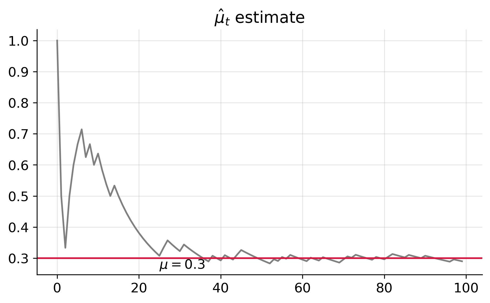
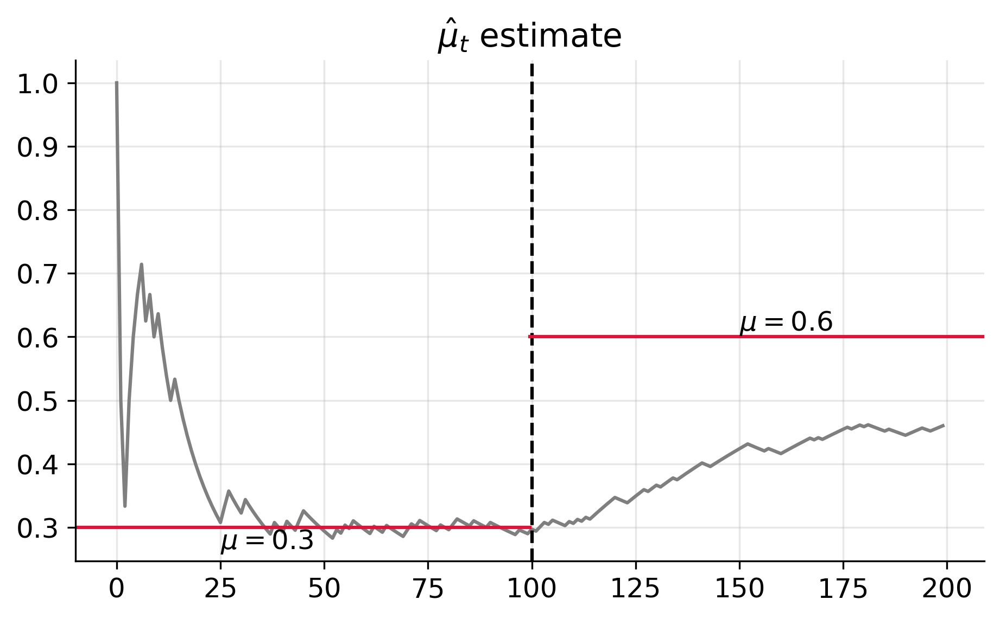
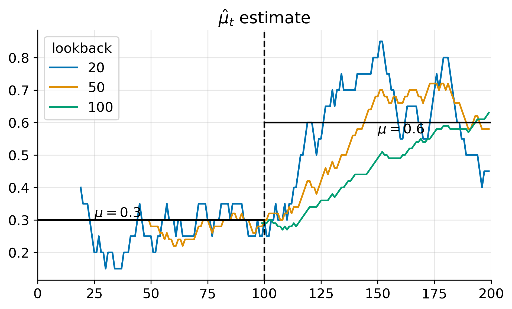
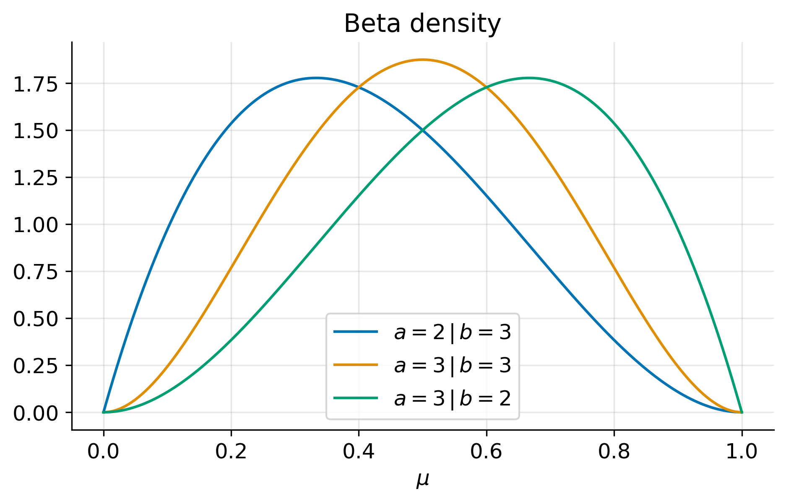
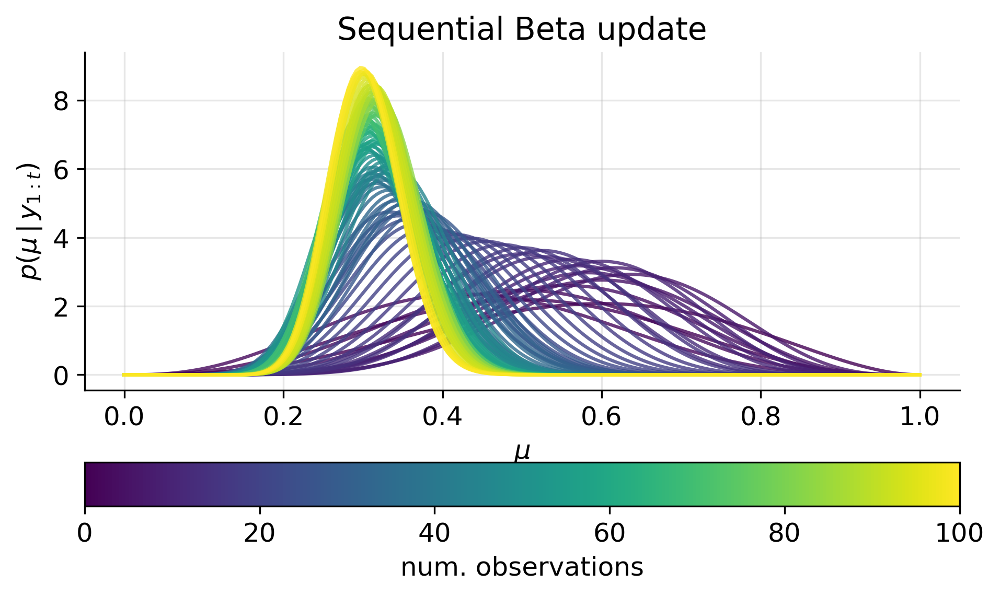
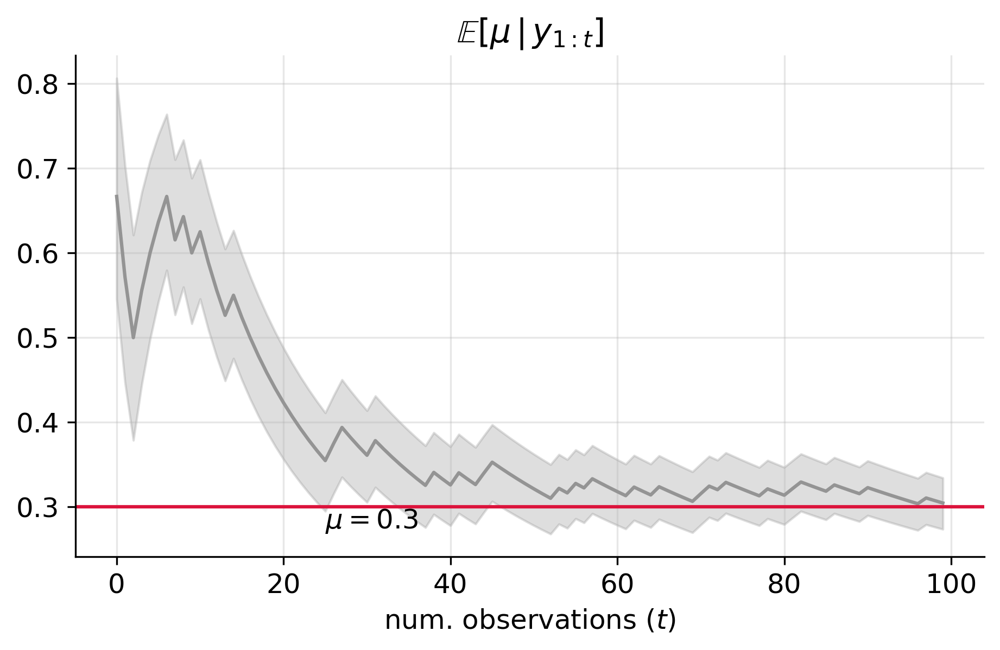
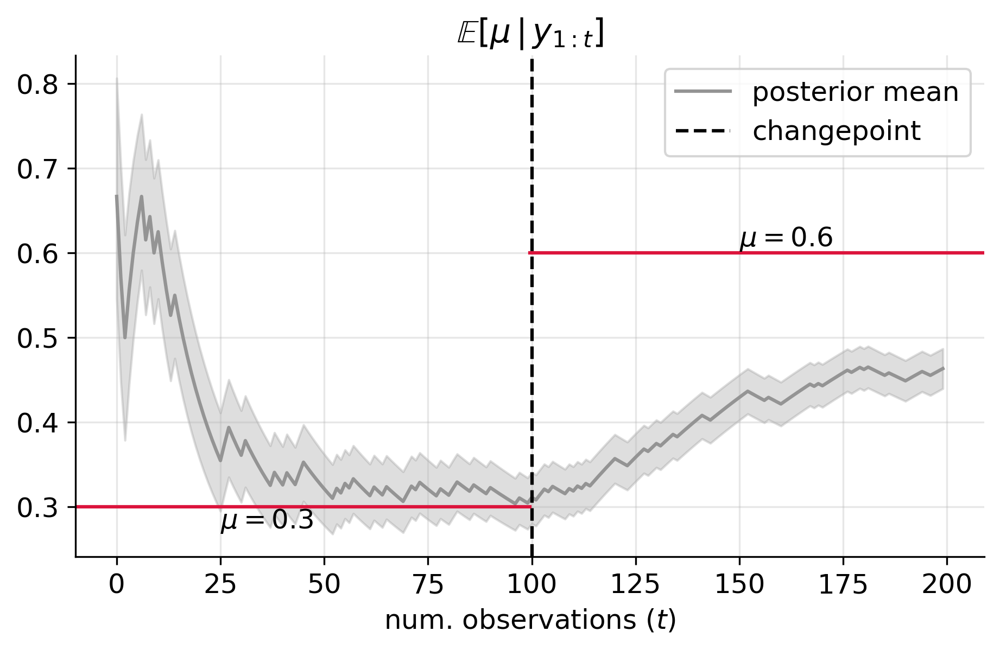
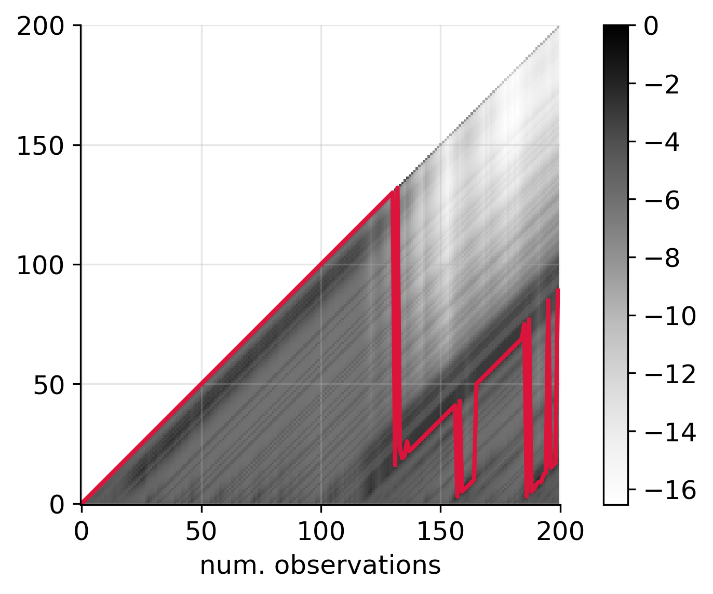
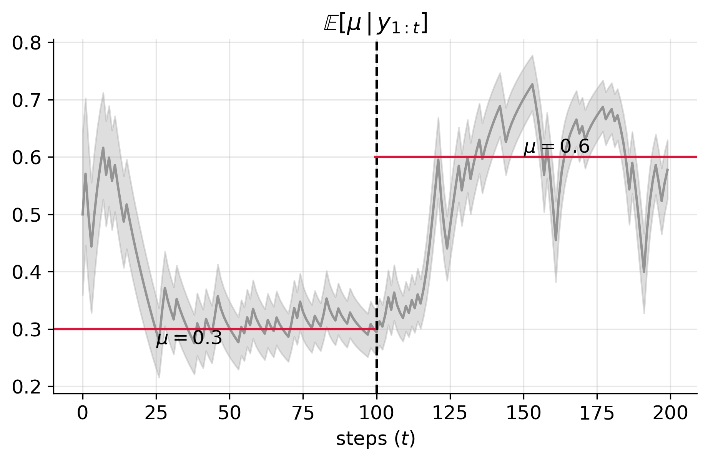

# Introduction
In a world where conditions constantly change, how can we accurately predict outcomes?


## Flipping coins with fixed probability
Suppose the following sequence of coin tosses arrive in a stream:
```
1, 0, 0, 1, 1, 1, 1, 0, 1, 0, 1, 0, 0, 0, 1, 0, 0, 0, 0, 0, 0, 0,
0, 0, 0, 0, 1, 1, 0, 0, 0, 1, 0, 0, 0, 0, 0, 0, 1, 0, 0, 1, 0, 0,
1, 1, 0, 0, 0, 0, 0, 0, 0, 1, 0, 1, 0, 1, 0, 0, 0, 0, 1, 0, 0, 1,
0, 0, 0, 0, 1, 1, 0, 1, 0, 0, 0, 0, 1, 0, 0, 1, 1, 0, 0, 0, 1, 0,
0, 0, 1, 0, 0, 0, 0, 0, 0, 1, 0, 0
```
Here, `1` corresponds to heads and `0` corresponds to tails.

We want to estimate the probability of getting heads as we flip the coins.
A straightforward method is to count the number of heads that have appeared so far, divided by the total number of flips.

Mathematically, denote the sequence of flips by
$y_{1:t} = (y_1, \ldots, y_T)$, with
$y_t\in\{0, 1\}$ for $t = 1, \ldots, T$, and
$T$ is the length of the sequence.
The estimated probability of a heads after $t$ flips is given by

$$
    \hat{\mu}_t = \frac{1}{t}\sum_{k=1}^t \mathbb{1}(y_k = 1).
$$


The figure below shows the estimated probability of heads as a function of the flips shown above:

We observe that the strategy above correctly estimates the probability of a heads

This method works well when each coin flip is independent and identically distributed (i.i.d.).
But what happens when the odds change midstream?

## Non-starionary coin flipping: when the rules change
In many real-world scenarios, the assumption of i.i.d. doesn't hold.
For example, consider the following sequence of 200 coin flips.
In the first 100 flips, the probability of heads is `0.3`,
while in the last 100 flips, the probability increases to `0.6`:
```
1, 0, 0, 1, 1, 1, 1, 0, 1, 0, 1, 0, 0, 0, 1, 0, 0, 0, 0, 0, 0, 0,
0, 0, 0, 0, 1, 1, 0, 0, 0, 1, 0, 0, 0, 0, 0, 0, 1, 0, 0, 1, 0, 0,
1, 1, 0, 0, 0, 0, 0, 0, 0, 1, 0, 1, 0, 1, 0, 0, 0, 0, 1, 0, 0, 1,
0, 0, 0, 0, 1, 1, 0, 1, 0, 0, 0, 0, 1, 0, 0, 1, 1, 0, 0, 0, 1, 0,
0, 0, 1, 0, 0, 0, 0, 0, 0, 1, 0, 0, 1, 0, 1, 1, 0, 1, 0, 0, 0, 1,
0, 1, 0, 1, 0, 1, 1, 1, 1, 1, 1, 0, 0, 0, 1, 1, 1, 1, 0, 1, 1, 0,
1, 1, 1, 0, 1, 1, 1, 1, 1, 1, 0, 0, 1, 1, 1, 1, 1, 1, 1, 1, 1, 0,
0, 0, 0, 1, 0, 0, 0, 1, 1, 1, 1, 1, 1, 1, 0, 1, 0, 1, 1, 1, 1, 1,
1, 0, 1, 1, 0, 1, 0, 0, 0, 0, 1, 0, 0, 0, 0, 1, 1, 1, 1, 0, 0, 1,
1, 1
```

The figure below shows the estimate of heads using the simple counting formula:

Here, we see that while the method correctly estimates the probability for the first 100 flips,
it fails to capture the shift in the second set of flips.
This highlights a crucial limitation — static methods struggle when dealing with dynamic, non-stationary data.


### The rolling-mean strategy: adapting to a change
To address the non-stationarity in the data,
we can reduce the amount of data we consider for estimating the probability of heads.
One approach is to use a _rolling mean_, where we only look at the most recent flips.


In this case, the estimate of the probability becomes:  

$$
    \hat{\mu}_t^{(\ell)} = \frac{1}{\ell}\sum_{k=1}^{\ell} y_{t - k},
$$

for $t \geq \ell$.
Here, $\ell$ represents the _lookback_ or _runlength_.


The figure below shows the rolling mean estimate of the flips for various levels of lookback $\ell$:


Notice how different lookbacks estimate the true probability of `0.6` at $t \geq 100$ differently. For instance:
- $\ell = 20$ is closest to the true probability at $t = 120$;
- $\ell = 50$ is closest at $t = 150$;
- $\ell = 100$ is closest at $t = 200$.

This observation aligns with our intuition that $\ell$ reflects the number of timesteps in the current regime.
However, as the example shows, picking the right lookback window can be tricky.
What if there was a way to automatically adapt this lookback as the data evolves?


### Rolling means, regime changes, and Bayes: enter the BOCD

As we've seen, the optimal lookback $\ell$ shifts as time $t$ progresses.
This raises a critical question: At any given time $t$, how do we determine the _best_ lookback period?
Here, the _best_ lookback is the one that most accurately reflects the probability of heads in the current regime.

This is where the [Bayesian Online Changepoint Detection (BOCD)](https://arxiv.org/abs/0710.3742)
algorithm comes into play.
As we will see,
BOCD works by weighting different lookbacks according to their probability,
allowing it to detect changes in real time and dynamically adjust predictions.
This real-time adaptability is essential for making accurate predictions in rapidly changing environments.

To fully understand how BOCD operates, especially in the context of binary data, we need to lay some groundwork.
In the following section, we'll explore key concepts in Bayesian inference, such as
conjugate priors, probability distributions, and how these ideas come together to form the foundation of the BOCD algorithm.

---

# The Bayesian perspective

In this section, we'll revisit the problem of estimating the probability of heads using a Bayesian approach.
Unlike the frequentist method, which provides a single point estimate (e.g., $\mu = 0.3$),
the Bayesian approach offers a probability distribution over possible values of $\mu$.
This distribution gives us a richer understanding of our uncertainty about the true probability of heads.

The core idea is that instead of estimating $\mu$ as a single number,
we compute a posterior density over $\mu$,
which represents our updated beliefs about the probability of heads after observing $t$ coin flips.
To compute this posterior, we need two key components: the prior and the likelihood.

### The Prior Density

The prior density reflects our beliefs about the probability of heads before we observe any data.
A natural choice for this prior is the Beta distribution,
which is defined on the interval $(0,1)$, the same interval in which $\mu$ lies.
The Beta distribution is also convenient because it is conjugate to the Bernoulli likelihood,
meaning it simplifies the math when we update our beliefs.
We will come back to this point below.

The Beta density is defined as:

$$
\tag{2}
    \text{Beta}(\mu\,|\,a,b) = \frac{\Gamma(a)\,\Gamma(b)}{\Gamma(a + b)} \mu^{a-1}(1-\mu)^{b-1}
$$

where $\Gamma(z)$ is the gamma function and $a, b > 0$ are shape parameters that control the skewness of the distribution.

The following figure shows the probability density function (pdf) of the Beta distribution for different values of $a$ and $b$.


Notice how the shape of the distribution changes based on the relationship between $a$ and $b$:
- When $a > b$, the density is skewed toward 1 (indicating a higher belief in heads).
- When $a < b$, the density is skewed toward 0 (indicating a higher belief in tails).
- When $a = b$, the density is symmetric, indicating equal probability for heads and tails.

In the special case where $a = b$,
the magnitude of $a$ and $b$ reflects how confident we are in this assumption of equal probability.
Larger values of $a$ and $b$ correspond to stronger prior beliefs,
meaning we are more certain that the true probability of heads and tails is close to 0.5.
Conversely, smaller values of $a$ and $b$ indicate weaker prior beliefs, implying more uncertainty around this assumption.


### The Likelihood

The likelihood represents the process by which the coin flips are generated.
 For this problem, the natural choice is the Bernoulli mass function,
 which takes the form

$$
\tag{1}
    p(y\,\vert\,\mu) = \mu^y\,(1 - \mu)^{1 - y}.
$$

Here, $\mu \in (0,1)$ is the probability of heads, and $y$ is the outcome of a single flip (1 for heads, 0 for tails).


### The Posterior Density

With both the prior and likelihood in hand,a we can now compute the posterior density,
which represents our updated beliefs about $\mu$ after observing $t$ coin flips ($y_{1:t}$).
This posterior distribution reflects how our beliefs about $\mu$ evolve as we observe more data,
continuously updating our uncertainty about the true probability of heads.

In general, the posterior density is proportional to the product of the prior and the likelihood:

$$
    p(\mu\,\vert\,y_{1:t}) \propto p(\mu)\,p(y_{1:t}\,\vert\,\mu).
$$


The symbol $\propto$ denotes proportionality, i.e., $f(x) \propto g(x)$ means that
$f(x) = c\,g(x)$
for some constant $c$ that does not depend on $x$.
In Bayesian inference,
this constant $c$ is typically found by normalizing the posterior so that it integrates to 1, ensuring it's a valid probability density.

By multiplying the prior and likelihood, we obtain a posterior distribution for $\mu$.
Conveniently, because we're using a Beta prior and Bernoulli likelihood, the resulting posterior is also a Beta distribution.
This conjugate relationship simplifies the math and makes it easy to update our beliefs as we observe more coin flips.


## Sequential Bayesian Update
Now that we've introduced the posterior density, we turn our attention to updating the posterior sequentially as we observe new data.
Since coin flips are independent and arrive in a stream,
the Bayesian approach allows us to update our beliefs step by step as new flips are observed.

To do this, suppose that our prior is Beta with parameters $a_0$ and $b_0$, so that:

$$
    p(\mu) = \text{Beta}(\mu\,|\,a_0, b_0).
$$


Then, by Bayes' rule, the posterior density of $\mu$ after observing $y_1$ is given by:

$$
\begin{aligned}
    p(\mu\,|\,y_1)
    &\propto p(y_1\,|\,\mu)\,p(\mu) \\
    &= {\rm Bern}(y_1\,|\,\mu)\,{\rm Beta}(\mu\,|\,a_0, b_0) \\
    &\propto \mu^{y_1}(1-\mu)^{1-y_1}\,\mu^{a_0-1}(1-\mu)^{b_0-1} \\
    &= \mu^{y_1 + a_0 - 1}(1-\mu)^{1-y_1 + b_0 - 1} \\
    &\propto \text{Beta}(\mu\,|\,a_1, b_1).
\end{aligned}
$$


with $a_1 = y_1 + a_0$ and $b_1 = 1 - y_1 + b_0$. 

From the above, we see that the posterior density of $\mu$ after observing $y_1$ is a Beta density with parameters $a_1$ and $b_1$.
This is a general property of the Beta-Bernoulli model, known as **conjugacy**.

Following the same reasoning, we can compute the posterior density of $\mu$, having $p(\mu\,|\,y_1)$ as the prior, after observing $y_2$:

$$
\begin{aligned}
    p(\mu\,|\,y_1, y_2)
    &\propto p(\mu\,|\,y_1)\,p(y_2\,|\,\mu, y_1) \\
    &= p(\mu\,|\,y_1)\,p(y_2\,|\,\mu) \\
    &\propto \mu^{a_1-1}(1-\mu)^{b_1-1}\,\mu^{y_2}(1-\mu)^{1-y_2} \\
    &= \mu^{a_1 + y_2 - 1}(1-\mu)^{b_1 + 1 - y_2 - 1} \\
    &\propto \text{Beta}(\mu\,|\,a_2, b_2).
\end{aligned}
$$


with $a_2 = a_1 + y_2$ and $b_2 = b_1 + 1 - y_2$.

In general, having a Beta prior at time $t-1$ with parameters $a_{t-1}$ and $b_{t-1}$,
the posterior density at time $t$ is Beta with parameters:
$$
a_t = a_{t-1} + y_t \quad \text{and} \quad b_t = b_{t-1} + 1 - y_t.
$$
Explicitly, the posterior density at time $t$ is given by:

$$
\tag{3}
\begin{aligned}
    p(\mu\,|\,y_{1:t})
    &= p(\mu\,|\,y_{1: t-1})\,p(y_t\,|\,\mu) \\
    &= \text{Beta}(\mu\,|\,a_t, b_t).
\end{aligned}
$$

with $a_t = a_{t-1} + y_t$ and $b_t = b_{t-1} + 1 - y_t$. Here, $y_{1:0} = \emptyset$.

To see this process in action, consider the following
simple Python implementation of the sequential Bayesian update for the Beta-Bernoulli model below.
This implementation allows us to update our beliefs about $\mu$ as new coin flips are observed in a data stream.

```python
def beta_update(a, b, y):
    a_new = a + y
    b_new = b + 1 - y
    return a_new, b_new
```

## An example: flipping coins with fixed probability
Let's explore the idea of sequential Bayesian updates with a practical example.
Suppose we observe the following sequence of coin tosses,
where the true (but unknown) probability of heads is fixed at 0.3:
```
1, 0, 0, 1, 1, 1, 1, 0, 1, 0, 1, 0, 0, 0, 1, 0, 0, 0, 0, 0, 0, 0,
0, 0, 0, 0, 1, 1, 0, 0, 0, 1, 0, 0, 0, 0, 0, 0, 1, 0, 0, 1, 0, 0,
1, 1, 0, 0, 0, 0, 0, 0, 0, 1, 0, 1, 0, 1, 0, 0, 0, 0, 1, 0, 0, 1,
0, 0, 0, 0, 1, 1, 0, 1, 0, 0, 0, 0, 1, 0, 0, 1, 1, 0, 0, 0, 1, 0,
0, 0, 1, 0, 0, 0, 0, 0, 0, 1, 0, 0
```


For this example,
we assume that the prior distribution for the probability of heads is a Beta distribution with parameters
$a_0 = b_0 = 3$.
This corresponds to a prior mean of $0.5$ and a 95\% credible interval of approximately $[0.15, 0.85]$.
This prior reflects an initial belief that the coin is likely fair (with a probability of heads around 0.5),
but we are quite uncertain, allowing for a wide range of possible values.

With the prior now specified,
we can proceed to apply the sequential Bayesian update using equation $(3)$,
allowing us to refine our belief about the probability of heads with each new observation.
The following figure illustrates how the posterior density of $\mu$ evolves as a function of the number of coin flips.

As we observe more coin flips, the posterior density becomes more concentrated around a specific value,
and its variance decreases.
This reflects the fact that as more data is gathered,
we become more confident in our estimate of $\mu$.
In this case, the posterior mode converges to a value close to $0.3$, which is the true probability of heads.

We can also compute the *expected posterior probability* of heads. This is given by:

$$
\begin{aligned}
    \mathbb{E}[\mu\,|\,y_{1:t}]
    &= \int \mu\,p(\mu\,|\,y_{1:t})\,d\mu\\
    &= \frac{a_t}{a_t + b_t}.
\end{aligned}
$$


The following figure shows the expected posterior probability of heads (`1`)
as a function of the number of observations,
with the error bounds representing the 50% credible interval
(the Bayesian counterpart to the confidence interval). 

We observe that the expected posterior probability of heads converges to around $0.3$,
indicating that the coin is biased toward tails (`0`).
Additionally, as more observations are made,
the uncertainty around this estimate decreases, as shown by the narrowing credible interval.

## What if the Probability Changes? — When (iid) Bayesian Inference Fails
In real-world scenarios, it's common for underlying probabilities to change over time.
For instance, suppose the probability of heads is $p_1$ for the first 100 tosses and then changes to $p_2$ for the remaining tosses.
This shift in probability is known as a *changepoint*,
and the first toss with a probability of heads of $p_1$ marks the moment when the change occurs.

At first glance, it might seem intuitive that by using the Bayesian update process,
we could sequentially observe the data, detect the changepoint, and adapt our beliefs accordingly.
However, this assumption leads to incorrect conclusions when using the Beta-Bernoulli (BB) model.

The issue lies in two key assumptions of the BB-model:

1. **Constant Probability**: The BB-model assumes that the probability of heads, $\mu$, is unknown but constant throughout the entire sequence. It does not account for any changes in the underlying process.
2. **Equal Weighting of Observations**: The Bayesian update process in the BB-model computes the posterior by summing the prior and all observations equally, regardless of whether a changepoint has occurred. This means the model will continue averaging observations from both before and after the changepoint, without distinguishing between them.

To see an example of this limitation, consider the following sequence of coin tosses, where the first 100 flips have a probability of heads $0.3$, and the last 100 flips have a probability of heads $0.6$:  
```
1, 0, 0, 1, 1, 1, 1, 0, 1, 0, 1, 0, 0, 0, 1, 0, 0, 0, 0, 0, 0, 0,
0, 0, 0, 0, 1, 1, 0, 0, 0, 1, 0, 0, 0, 0, 0, 0, 1, 0, 0, 1, 0, 0,
1, 1, 0, 0, 0, 0, 0, 0, 0, 1, 0, 1, 0, 1, 0, 0, 0, 0, 1, 0, 0, 1,
0, 0, 0, 0, 1, 1, 0, 1, 0, 0, 0, 0, 1, 0, 0, 1, 1, 0, 0, 0, 1, 0,
0, 0, 1, 0, 0, 0, 0, 0, 0, 1, 0, 0, 1, 0, 1, 1, 0, 1, 0, 0, 0, 1,
0, 1, 0, 1, 0, 1, 1, 1, 1, 1, 1, 0, 0, 0, 1, 1, 1, 1, 0, 1, 1, 0,
1, 1, 1, 0, 1, 1, 1, 1, 1, 1, 0, 0, 1, 1, 1, 1, 1, 1, 1, 1, 1, 0,
0, 0, 0, 1, 0, 0, 0, 1, 1, 1, 1, 1, 1, 1, 0, 1, 0, 1, 1, 1, 1, 1,
1, 0, 1, 1, 0, 1, 0, 0, 0, 0, 1, 0, 0, 0, 0, 1, 1, 1, 1, 0, 0, 1,
1, 1
```

The following figure shows the expected value of $\mu$ (the posterior mean) as a function of the number of observations. The dashed line indicates the changepoint, where the probability of heads shifts from $0.3$ to $0.6$:


As expected, the posterior mean of $\mu$ continues to update after the changepoint,
but it fails to reflect the true change in the underlying probability.
This happens because the Beta-Bernoulli model continues to average all observations, smoothing over the changepoint. While the uncertainty of the estimate decreases with more observations, the model never fully adapts to the new probability.

Does this mean that Bayesian inference is not useful in non-stationary environments? Not necessarily. What this example shows is that, under the assumption of an iid model, Bayesian inference using conjugate models cannot detect changes in the underlying probability.

An important takeaway from the plot above is that the posterior mean closely mirrors the cumulative mean we previously discussed. In fact, when $a_0 = b_0 = 1$, the expected posterior probability matches the cumulative mean exactly.


---

# The Bayesian Online Changepoint Detection (BOCD) for a Bernoulli-Beta model: adaptive lookback windows

In previous sections,
we highlighted the strength of Bayesian inference in
treating variables probabilistically and continuously updating beliefs as new data arrives.
We also discussed how rolling time windows can help address non-stationarity by focusing on recent data.

In this section, we introduce a model that combines
the sequential updating and uncertainty quantification of Bayesian inference with
the flexibility of rolling time windows.
To do this, we extend the probabilistic model to include the lookback window $\ell$ as a random variable.

This extension enables the model to
either dynamically select the optimal lookback window or
average across multiple windows, weighted by their probabilities.
By incorporating this adaptive lookback,
the model becomes capable of responding to changepoints in the data and adjusting accordingly.

The resulting algorithm is known as the **Bayesian Online Changepoint Detection (BOCD)**
and it was first introduced (in the form we present in this post) in the 2007 paper by Adams and Macay.
In the following sections,
we formalise the ideas behind BOCD and explain
how to detect changepoint detection with the Bernoulli-Beta model.

## A probabilistic model for the lookback window

Recall the non-stationary coin-tossing problem.
Suppose we are at time $t$, we have access to the observations $y_{1:t}$,
and we are told that a *changepoint* occurred $\ell_t \geq 1$ steps ago.
In other words, the probability of heads for the observations $y_{\ell_t+1:t}$
is different than that for the earlier observations $y_{1:\ell_t}$.
Furthermore, suppose that the unknown probability of heads remains constant for all coin tosses in the interval
$\{\ell_t + 1, \ldots, t\}$.

With this assumption, we define prior probability of heads,
conditioned on the history $y_{1:t}$ and the lookback $\ell_t$, as:

$$
    p(\mu\,\vert\,\ell_t=k, y_{1:t}) := p(\mu\,\vert\,y_{t-k+1:t}).
$$

This formulation implies that if $\ell_t = 0$, we start our inference from scratch.
If $\ell_t = 1$, we base our posterior beliefs solely on the most recent observation.
If $\ell_t = t$, we use all observations up to time $t$.
The lookback window $\ell_t$ thus represents how much past data we consider relevant for estimating the current probability of heads.
[^def-rlp]

Armed with our conditional prior definition,
we now determine the probability of each possible value of the lookback.
Observe that, at time $t$, the runlengtht takes possible values
$\ell_t \in \{0, 1, \ldots, t\}$.
Following a Bayesian formulation, we seek to determine the *posterior mass*
of the lookback conditioned on the history up to time $t$.
That is, we seek to evaluate


$$
    p(\ell_t\vert y_{1:t})
    = \frac{p(\ell_t, y_{1:t})}{p(y_{1:t})}
    = \frac{p(\ell_t, y_{1:t})}{\sum_{\ell=0}^t p(\ell, y_{1:t})},
$$

for $\ell_t = 0, \ldots, t$.

Because the space is discrete,
to specify the posterior mass function, we only
need to evaluate the joint probability $p(\ell_t, y_{1:t})$
for all values
$\ell_t \in \{0, \ldots, t\}$
and then normalise over all of the computed values to obtain the posterior probability mass.

### Estimating the Joint Density

In the BOCD algorithm, the estimation of the joint density is done recursively, allowing for efficient detection of changepoints as new data arrives. The joint density at time $t$ can be rewritten as:


$$
\begin{aligned}
    p(\ell_t, y_{1:t})
    &= \sum_{\ell_{t-1}=0}^{t-1} p(\ell_t, \ell_{t-1}, y_{1:t-1}, y_t)\\
    &= \sum_{\ell_{t-1}=0}^{t-1}
    \underbrace{p(\ell_{t-1}, y_{1:t-1})}_\text{(A)} \,
    \underbrace{ p(\ell_t \vert \ell_{t-1}, y_{1:t-1})}_\text{(B)}\,
    \underbrace{p(y_t \vert \ell_t, \ell_{t-1}, y_{1:t-1})}_\text{(C)}.
\end{aligned}
$$


This decomposition gives us a recursive relationship that makes changepoint detection computationally feasible in an online setting. We formalise this process in the following proposition.

#### Proposition 1
Let $\pi \in (0, 1)$ and suppose that the probability of a changepoint follows the distribution:


$$
    p(\ell_t \vert \ell_{t-1}) =
    \begin{cases}
    \pi & \text{if } \ell_t = \ell_{t-1} + 1,\\
    1 - \pi & \text{if } \ell_{t} = 0,\\
    0 & \text{otherwise}.
    \end{cases}
$$


Further assume that the posterior predictive distribution for $y_t$ is independent of $\ell_{t-1}$, conditioned on $\ell_t$ and $y_{1:t-1}$, i.e.,


$$
    p(y_t \vert \ell_t, \ell_{t-1}, y_{1:t-1})
    = p(y_t \vert \ell_t, y_{1:t-1})
    = \int p(y_t \vert \theta)\,p(\theta \vert \ell_t, y_{1:t-1}){\rm d}\theta.
$$


Then, the joint density can be computed recursively as:

For $\ell_t = \ell_{t-1} + 1$ (i.e., no changepoint):

$$
    p(\ell_t, y_{1:t}) =
    \left(\frac{y_t\,a_{t-\ell_t-1:t-1} + (1 - y_t)\,b_{t-\ell_t-1:t-1}}{a_{t-\ell_t-1:t-1} + b_{t-\ell_t-1:t-1}}\right)\,
    (1-\pi)\,
    p(\ell_{t-1}, y_{1:t-1}),
$$


and for $\ell_t = 0$ (i.e., a changepoint occurs):


$$
    p(\ell_t, y_{1:t}) =
    \left(\frac{y_t\,a_{0} + (1 - y_t)\,b_{0}}{a_{0} + b_{0}}\right)\,
    \pi\,
    \sum_{\ell_{t-1}=0}^{t-1}p(\ell_{t-1}, y_{1:t-1}).
$$


where we have defined the quantities:


$$
\begin{aligned}
    a_{t-k:t} &= a_0 + \sum_{j=0}^k y_{t - k + j},\\
    b_{t-k:t} &= b_0 + k - \sum_{j=0}^k y_{t - k + j}.
\end{aligned}
$$

See [proof 1]() in the Appendix for a proof.

Proposition 1 shows that at time $t$, the joint density $p(\ell_t, y_{1:t})$ for $\ell_t > 0$ is given by the product of the joint density at time $t-1$ (for $\ell_{t-1} = \ell_t - 1$), the probability of no changepoint ($1 - \pi$), and the posterior predictive density $p(y_t \vert \ell_t, y_{1:t-1})$.

## BOCD Predictions

To recap, the BOCD algorithm estimates the joint density between the runlength (lookback window) $\ell_t$ and the data $y_{1:t}$ recursively, using the previous joint density $p(\ell_{t-1}, y_{1:t-1})$. This recursive structure allows us to efficiently update the model's beliefs and detect changepoints as new data comes in.

The joint density can be used to compute the posterior over the runlength, which reflects how likely each lookback window is, given the data:

$$
    p(\ell_t \vert y_{1:t}) = \frac{p(\ell_t, y_{1:t})}{p(y_{1:t})} = \frac{p(\ell_t, y_{1:t})}{\sum_{\ell_t'=0}^t p(\ell_t', y_{1:t})}.
$$


Once we have the set of posterior probabilities $\{p(\ell_t \vert y_{1:t})\}_{\ell_t=0}^t$, we can make predictions for the probability of heads, $\mu$, by taking a weighted average over different lookback windows. Specifically, the expected value of $\mu$ is given by:

$$
\begin{aligned}
    \mathbb{E}[\mu \vert y_{1:t}]
    &= \sum_{\ell_t=0}^t p(\ell_t \vert y_{1:t}) \int_{(0,1)} \mu\,p(\mu \vert y_{t-\ell_t+1:t})\,{\rm d}\mu\\
    &= \sum_{\ell_t=0}^t p(\ell_t \vert y_{1:t}) \frac{a_{t-\ell_t+1:t}}{a_{t - \ell_t + 1:t} + b_{t - \ell_t + 1:t}}.
\end{aligned}
$$


This formula uses the posterior probabilities of each runlength to compute a weighted sum over the expected values of $\mu$, where the weights are determined by the probability of each lookback window.

## Implementation of the BOCD

### The Log-Joint Density

In practice, directly computing the joint density can lead to numerical underflow, especially when dealing with small probabilities. To address this, we compute the log-joint-density $\log p(\ell_t, y_{1:t})$, which improves numerical stability. The log-joint for $\ell_t = \ell_{t-1} + 1$ (i.e., no changepoint) is given by:


$$
    \log p(\ell_t, y_{1:t}) =
    \log\left(\frac{y_t\,a_{t-\ell_t-1:t-1} + (1 - y_t)\,b_{t-\ell_t-1:t-1}}{a_{t-\ell_t-1:t-1} + b_{t-\ell_t-1:t-1}}\right) + 
    \log(1-\pi) +
    \log p(\ell_{t-1}, y_{1:t-1}),
$$


and for $\ell_t = 0$ (i.e., a changepoint occurs):


$$
\begin{aligned}
    &\log p(\ell_t, y_{1:t})
    \\&=
    \log\left(\frac{y_t\,a_{t-\ell_t-1:t-1} + (1 - y_t)\,b_{t-\ell_t-1:t-1}}{a_{t-\ell_t-1:t-1} + b_{t-\ell_t-1:t-1}}\right) +
    \log\pi + 
    \log\left(\sum_{\ell_{t-1}=0}^{t-1}p(\ell_{t-1}, y_{1:t-1})\right)\\
    &=
    \log\left(\frac{y_t\,a_{t-\ell_t-1:t-1} + (1 - y_t)\,b_{t-\ell_t-1:t-1}}{a_{t-\ell_t-1:t-1} + b_{t-\ell_t-1:t-1}}\right) +
    \log\pi + 
    \log\left(\sum_{\ell_{t-1}=0}^{t-1}\exp(\log(p(\ell_{t-1}, y_{1:t-1})))\right)\\
    &=
    \log\left(\frac{y_t\,a_{t-\ell_t-1:t-1} + (1 - y_t)\,b_{t-\ell_t-1:t-1}}{a_{t-\ell_t-1:t-1} + b_{t-\ell_t-1:t-1}}\right) +
    \log\pi + 
    {\rm logsumexp}\left(\{\log p(\ell_{t-1}, r_{1:t-1})\}_{\ell_{t-1}=0}^{t-1}\right)\\
\end{aligned}
$$

for $\ell_{t} = 0$.

By operating in log-space, we avoid numerical underflow while efficiently computing the recursive joint densities and detecting changepoints.

### The recursive updates
In this section, we provide a detailed description on the implementation of BOCD for the BB-model.
First, we note that the computational complexity of the algorithm is *linear in time*.
This means that the amount of computations we have to perform increases by one at each new timestep.
To see this, consider the array below, which specifies the required collections to compute $p(\ell_t \vert y_{1:t})$

$$
\begin{array}{c|ccccc}
t & & & & & & \\
0 & \emptyset & & & & & & \\
1 & \emptyset & y_1 & & & & & \\
2 & \emptyset & y_2 & y_{1:2} & & & & \\
3 & \emptyset & y_3 & y_{2:3} & y_{1:3} & & & \\
4 & \emptyset & y_4 & y_{3:4} & y_{2:4} & y_{1:4} & & \\
5 & \emptyset & y_5 & y_{4:5} & y_{3:5} & y_{2:5} & y_{1:5} & \\
6 & \emptyset & y_6 & y_{5:6} & y_{4:6} & y_{3:6} & y_{2:6} & y_{1:6} \\
\hline
\ell_t & 0 & 1 & 2 & 3 & 4 & 5 & 6
\end{array}
$$


If $\ell_t > 0$, the BOCD algorithm updates the joint $p(\ell_t, y_{1:t})$ diagonally, i.e.,

$$
    {\color{teal} p(\ell_{t} - 1, y_{1:t-1})} \to {\color{orange} p(\ell_{t}, y_{1:t})} \gets y_t
$$



$$
\begin{array}{c|ccccc}
t & & & & & & \\
0 & p(0, y_{1:0}) & & & & & & \\
1 & p(0, y_{1:1}) & p(1, y_{1:1}) & & & & & \\
2 & p(0, y_{1:2}) & p(1, y_{1:2}) & p(2, y_{1:2}) & & & & \\
3 & p(0, y_{1:3}) & p(1, y_{1:3}) & p(2, y_{1:3}) & p(3, y_{1:3}) & & & \\
4 & p(0, y_{1:4}) & p(1, y_{1:4}) & \color{teal}{p(2, y_{1:4})} & p(3, y_{1:4}) & p(4, y_{1:4}) & & \\
5 & p(0, y_{1:5}) & p(1, y_{1:5}) & p(2, y_{1:5}) & \color{orange}{p(3, y_{1:5})} & p(4, y_{1:5}) & p(5, y_{1:5}) & \\
6 & p(0, y_{1:6}) & p(1, y_{1:6}) & p(2, y_{1:6}) & p(3, y_{1:6}) & p(4, y_{1:6}) & p(5, y_{1:6}) & p(6, y_{1:6}) \\
\hline
\ell_t & 0 & 1 & 2 & 3 & 4 & 5 & 6
\end{array}
$$


This means that the log-joint for $\ell_t > 0$ can be updated as
```
log_joint = log_predict + log_joint_prev[k-1] + log(1 - pi)
```

Conversely, if $\ell_t = 0$, the BOCD algorithm updates the joint $p(0, y_{1:t})$ from all values at $t-1$, i.e.,

$$
\begin{aligned}
    {\color{teal} p(0, y_{1:t-1})} &\to {\color{orange} p(0, y_{1:t})}\\
    {\color{teal} p(1, y_{1:t-1})} &\to {\color{orange} p(0, y_{1:t})}\\
    &\vdots \\
    {\color{teal} p(t-1, y_{1:t-1})} &\to {\color{orange} p(0, y_{1:t})}
\end{aligned}
$$


$$
\begin{array}{c|ccccc}
t & & & & & & \\
0 & p(0, y_{1:0}) & & & & & & \\
1 & p(0, y_{1:1}) & p(1, y_{1:1}) & & & & & \\
2 & p(0, y_{1:2}) & p(1, y_{1:2}) & p(2, y_{1:2}) & & & & \\
3 & p(0, y_{1:3}) & p(1, y_{1:3}) & p(2, y_{1:3}) & p(3, y_{1:3}) & & & \\
4 & \color{teal}{p(0, y_{1:4})} & \color{teal}{p(1, y_{1:4})} & \color{teal}{p(2, y_{1:4})} & \color{teal}{p(3, y_{1:4})} & \color{teal}{p(4, y_{1:4})} & & \\
5 & \color{orange}{p(0, y_{1:5})} & p(1, y_{1:5}) & p(2, y_{1:5}) & p(3, y_{1:5}) & p(4, y_{1:5}) & p(5, y_{1:5}) & \\
6 & p(0, y_{1:6}) & p(1, y_{1:6}) & p(2, y_{1:6}) & p(3, y_{1:6}) & p(4, y_{1:6}) & p(5, y_{1:6}) & p(6, y_{1:6}) \\
\hline
\ell_t & 0 & 1 & 2 & 3 & 4 & 5 & 6
\end{array}
$$

```
log_joint + logsumexp(log_joint_prev[:] + log(pi))
```

### Pseudocode
The BOCD step at time $t$ can be defined by
```python
def bocd_step(y, k, a_prev, b_prev, log_joint_prev, pi):
    a, b = a_prev[k], b_prev[k]
    log_predict = log(y * a + (1 - y) * b) - log(a + b)
    if k > 0:
        # no changepoint
        log_joint = log_joint + log_joint_prev[k-1] + log(1 - pi)
    else:
        # changepoint
        log_joint = log_joint + logsumexp(log_joint_prev + log(pi))

    # Beta-Bernoulli update
    a_update = a + y
    b_update = b + (1 - y)

    return a_update, b_update, log_joint
```

An update for all possible values of $\ell_t$ is given by
```python
def init_bocd_step(t):
    a_values = zeros(t)
    b_values = zeros(t)
    log_joint = zeros(t)
    return a_values, b_values, log_joint


def bocd_update(t, yt, a_prev, b_prev, log_joint_prev, pi):
    a_new, b_new, log_joint_new = init_bocd_step(t)
    for k in range(t + 1):
        a, b, log_joint = bocd_step(yt, k, a_prev, b_prev, log_joint_prev, pi)

        log_joint_new[k] = log_joint
        a_new[k] = a
        b_new[k] = b
    
    return a_new, b_new, log_joint_new
```

Then, a prediction for the probability of heads $\mu$ is given by

```python
def predict_proba(a_values, b_values, log_joint):
    mean_est = a_values / (a_values + b_values)
    log_posterior = log_joint - logsumexp(log_posterior)
    mean_est = mean_est * exp(log_posterior)
    mean_est = sum(mean_est)
    return mean_est
```

Finally, a full run of the algorithm is given by
```python
def bocd(y_values, pi):
    mean_estimates = zeros(len(y_values))
    a_values, b_values, log_joint = init_bocd_step(0)
    for t, y in enumerate(y_values):
        a_values, b_values, log_joint = bocd_update(
            t, y, a_values, b_values, log_joint, pi
        )
        mean_est = predict_proba(a_values, b_values, log_joint)
        mean_estimates[t] = mean_es
    return mean_estimates
```

For a full working example, see [this notebook](https://github.com/gerdm/bayes/blob/abe0e3f13d004a9d8bde179f8ac9375f3ba6050f/bocd.ipynb).

# The BOCD in practice
In this section, we apply the BB-BOCD algorithm for the non-stationary coin tosses dataset shown above.

## Probability of the runlength
First, we show the log posterior probability of a changepoint, i.e.,
we show $p(\ell_t \vert y_{1:t})$ for all possible pairs $(\ell_t, y_{1:t})$.
We plot in red the most likely runlenght, which corresponds to $\ell_t^* = \argmax_\ell p(\ell, y_{1:t})$
for $t=1,\ldots, T$.

We observe that the BOCD algorithm captures the changepoint.
However, it takes a few extra timesteps to obtain high confidence of the changepoint.

## Online estimate of the probability of heads
Next, we plot the mean posterior predictive.

As we saw for the probability of runlength, the BOCD detects a changepoint around 20 steps
after the actual changepoint occurred. This is translated into change in the posterior predictive
mean after these 20 timesteps.

# Overcoming the linear complexity
In this section, we provide a simple way to overcome the linear complexity of the BOCD.
This allows us to run the algorithm indefinitely without incurring an increase in computational cost.
The resulting algorithm maintains a *buffer* of $K \geq 1$ possible runlengths.

Suppose that, at time $t \geq K$, we have these $K$ values in the form:

$$
    p(\ell_{t,k}, y_{1:t}) \quad \text{for } k=1, \ldots, K.
$$


Then, at time $t+1$, we update each element in the *buffer* to obtain:

$$
    p(\ell_{t+1,k}, y_{1:t+1}) \quad \text{for } k=0, \ldots, K,
$$

where $p(\ell_{t+1,0}, y_{1:t+1}) = p(0, y_{1:t+1})$.

We then sort:
$\{p(\ell_{t,0}, y_{1:t+1}), \ldots, p(\ell_{t,K}, y_{1:t+1})\}$  
in descending order and remove the smallest element to obtain the new $K$ values. The algorithm then proceeds as normal.

For $t < K$, we simply evaluate all possible values until the *buffer* is filled.

# Drawbacks of the BOCD algorithm
Despite the relative simplicity of BOCD, it does come with a few drawbacks.

First, in the form we have presented the BOCD algorithm, we assumed a fixed and known hazard rate, $\pi$. If this value is unknown or misestimated, it can lead to either over-detection or under-detection of changepoints.

Second, we assumed a well-specified model. This can be problematic in scenarios with outliers or when the model is misspecified, potentially leading to inaccurate changepoint detection.

Third, we only considered conjugate models, which limits the flexibility of the approach.

Finally, we assumed that regime changes occur abruptly, without allowing for *smooth* transitions between regimes. This may not always be realistic in real-world scenarios where gradual changes are common.
 
The BOCD algorithm is a solid first approximation for tackling the problem of non-stationarity from a Bayesian perspective.


# Discussion
In this post, we explored the BOCD algorithm, a Bayesian method designed to detect and adapt to regime changes, provided these changes occur *abruptly* with a probability $\pi$. A more general formulation of the BOCD algorithm models regime changes using a probability function $H(r_t)$, wher
 $H: \mathbb{N} \to (0,1)$ is the *hazard rate*,
 which quantifies the likelihood of a regime change occurring at a given time.

The key questions about the BB-BOCD are:
1. When are changepoints detected?
2. What is the probability of heads?

Addressing the first question, it is important to note that the BOCD algorithm does not *detect* a changepoint in the traditional sense. Instead, it evaluates the probability that a changepoint occurred $r_t$ steps ago. Consequently, merely taking the ${\rm argmax}$ of the most likely run length may not capture the entire scenario. As illustrated in the heatmap for the probability of the run length, which shows the distribution of probabilities over different run lengths, relying solely on the argmax, while straightforward, can yield noisy results even in well-specified scenarios, which is the context we examined in this post.

For the second question, the probability of heads can also be easily determined by taking the argmax over the most likely path and evaluating the probability of heads. However, a more principled approach would involve the weighted method detailed in the section [BOCD Predictions](), as this method accounts for each value of $\mu$ according to its probability.

Understanding these nuances in the BOCD algorithm not only enhances its practical application but also informs all the developments in Bayesian change point detection literature.

---

# Appendix

## Proof of Proposition 1
Here, we show [Proposition 1]().

$$
    p(\ell_t, y_{1:t}) =
    \begin{cases}
        p(y_t \vert \ell_t, y_{1:t-1})\,p(\ell_{t-1}, y_{1:t-1})\,\pi & \text{for } \ell_t \in \{1, \ldots, t\},\\
        p(y_t \vert \ell_t, y_{1:t-1})\,\sum_{\ell_{t-1}=0}^{t-1} p(\ell_{t-1}, y_{1:t-1})\,(1-\pi) & \text{for } \ell_t=0.
    \end{cases}
$$

Furthermore, the conditional posterior predictive for the BB model takes the form

$$
    p(y_t \vert \ell_t, y_{1:t-1})
    = \frac{a_{t-\ell_t-1:t-1}}{a_{t-1-\ell_{t-1}-1:t-1} + b_{t-1-\ell_{t-1}-1:t-1}},
$$

where

$$
    \begin{aligned}
    a_{t-\ell_t:t} &= a_0 + \sum_{k=0}^{\ell_t} y_{t-\ell_t+k},\\
    b_{t-\ell_t:t} &= b_0 + \ell_t - \sum_{k=0}^{\ell_t} y_{t-\ell_t+k},
    \end{aligned}
$$

are the posterior parameters for the BB model at time $t$, under a runlength of size $\ell$.

We begin by rewriting the log-joint

$$
\begin{aligned}
    p(\ell_t,\,y_{1:t})
    &= \sum_{j=1}^{t-1} p(\ell_t, \ell_{t-1}, y_{1:t})\\
    &= \sum_{j=1}^{t-1} p(\ell_t, \ell_{t-1}, y_{1:t-1}, y_t)\\
    &= \sum_{j=1}^{t-1} p(\ell_{t-1}, y_{1:t-1})\,p(\ell_t,\,y_t\vert \ell_{t-1}, y_{1:t-1})\\
    &= \sum_{j=1}^{t-1} p(\ell_{t-1}, y_{1:t-1})\,p(\ell_t,\,y_t\vert \ell_{t-1}, y_{1:t-1})\\
    &= \sum_{j=0}^{t-1}
    \underbrace{
    p(\ell_{t-1}, y_{1:t-1})
    }_{({\rm A})}
    \,
    \underbrace{
    p(\ell_t,\vert \ell_{t-1}, y_{1:t-1})
    }_{({\rm B})}
    \,
    \underbrace{
    p(y_t \vert \ell_t, \ell_{t-1}, y_{1:t-1})
    }_{({\rm C})}
\end{aligned}
$$


The value of $({\rm A})$ is assumed to be computed at time $t-1$ for $j=1,\ldots, t-1$.

Next, $\ell_t$ is assumed to be independent on the $y_{1:t-1}$ conditioned on $\ell_{t-1}$.
So that $(\text{B})$ becomes

$$
    p(\ell_t\vert \ell_{t-1}) =
    \begin{cases}
    \pi & \ell_t = 0,\\
    1 - \pi & \ell_{t} = \ell_{t-1} + 1,\\
    0 & \text{otherwise}.
    \end{cases}
$$


To determine $({\rm C})$, first note that

$$
    p(y_t \vert \ell_t, \ell_{t-1}, y_{1:t-1}) = p(y_t \vert \ell_t, y_{1:t-1}).
$$

Next,

$$
\begin{aligned}
    p(y_t \vert \ell_t, y_{1:t-1})
    &= \int p(\mu, y_t \vert \ell_t, y_{1:t-1}) {\rm d}\mu\\
    &= \int p(\mu \vert \ell_t, y_{1:t-1})\,p(y_t \vert \mu) {\rm d}\mu\\
    &= \int p(\mu \vert y_{t-1-{\ell_t}:t-1})\,p(y_t \vert \mu) {\rm d}\mu\\
    &= \int {\rm Beta}(\mu \vert a_{t-1-{\ell_t}:t-1}, b_{t-1-{\ell_t}:t-1})\,{\rm Bern}(y_t \vert \mu)  {\rm d}\mu\\
    &= \int
    \frac{\Gamma(a_{t-1-{\ell_t}:t-1})\Gamma(b_{t-1-{\ell_t}:t-1})}{\Gamma(a_{t-1-{\ell_t}:t-1} + b_{t-1-{\ell_t}:t-1})}
    \mu^{a_{t-1-{\ell_t}:t-1}}\,(1 - \mu)^{b_{t-1-{\ell_t}:t-1}}\,\mu^{y_t}\,(1-\mu)^{1 - y_t} {\rm d}\mu\\
    &=
    \frac{\Gamma(a_{t-1-{\ell_t}:t-1})\Gamma(b_{t-1-{\ell_t}:t-1})}{\Gamma(a_{t-1-{\ell_t}:t-1} + b_{t-1-{\ell_t}:t-1})}
    \int\mu^{a_{t-1-{\ell_t}:t-1}}\,(1 - \mu)^{b_{t-1-{\ell_t}:t-1}}\,\mu^{y_t}\,(1-\mu)^{1 - y_t} {\rm d}\mu\\
    &= 
    \frac{\Gamma(a_{t-1-{\ell_t}:t-1})\Gamma(b_{t-1-{\ell_t}:t-1})}{\Gamma(a_{t-1-{\ell_t}:t-1} + b_{t-1-{\ell_t}:t-1})}
    \frac{\Gamma(a_{t-1-{\ell_t}:t-1} + b_{t-1-{\ell_t}:t-1} + y_t + 1 - y_t)}
    {\Gamma(a_{t-1-{\ell_t}:t-1} + y_t)\Gamma(b_{t-1-{\ell_t}:t-1} + 1 - y_t)}\\
    &= 
    \frac{\Gamma(a_{t-1-{\ell_t}:t-1})\Gamma(b_{t-1-{\ell_t}:t-1})}{\Gamma(a_{t-1-{\ell_t}:t-1} + b_{t-1-{\ell_t}:t-1})}
    \frac{\Gamma(a_{t-1-{\ell_t}:t-1} + b_{t-1-{\ell_t}:t-1} + 1)}
    {\Gamma(a_{t-1-{\ell_t}:t-1} + y_t)\Gamma(b_{t-1-{\ell_t}:t-1} + 1 - y_t)}
\end{aligned}
$$


Note that $z\Gamma(z)$ = $\Gamma(z + 1)$. Then,

$$
\begin{aligned}
    &\frac{\Gamma(a_{t-1-{\ell_t}:t-1} + 1)\Gamma(b_{t-1-{\ell_t}:t-1})}{\Gamma(a_{t-1-{\ell_t}:t-1} + b_{t-1-{\ell_t}:t-1} + 1)}\\
    =&\frac{\Gamma(a_{t-1-{\ell_t}:t-1})\Gamma(b_{t-1-{\ell_t}:t-1})}{\Gamma(a_{t-1-{\ell_t}:t-1} + b_{t-1-{\ell_t}:t-1})}
    \frac{a_{t-1-{\ell_t}:t-1}}{a_{t-1-{\ell_t}:t-1} + b_{t-1-{\ell_t}:t-1}}
\end{aligned}  
$$


Finally, we obtain

$$
    p(y_t \vert \ell_t, y_{1:t-1}) =\frac{a_{t-1-{\ell_t}:t-1}}{a_{t-1-{\ell_t}:t-1} + b_{t-1-{\ell_t}:t-1}}
$$

for $y_t = 1$.


With these equations, we see that

$$
    p(\ell_{t+1}, y_{1:t+1}) = p(\ell_{t}, y_{1:t})\,(1 - \pi)\,\frac{y_{t+1}\,a_{t-k:t} + (1 - y_{t+1})\,b_{t-k:t}}{a_{t-k:t} + b_{t-k:t}}
$$

for $\ell_{t+1} \geq 1$, $\ell_t = \ell_{t+1} -1$.

We also obtain

$$
    p(\ell_{t+1}, y_{1:t+1}) =
    \frac{y_{t+1}\,a_{0} + (1 - y_{t+1})\,b_{0}}{a_{0} + b_{0}}\sum_{\ell_t=0}^t p(\ell_{t}, y_{1:t})\,\pi
$$

for $\ell_{t+1} = 0$.
 $$ \ \tag*{$\blacksquare$} $$ 

[^def-rlp]: There is a more rigorous definition based on the product-partition model, but we will follow this much more simplified approach.