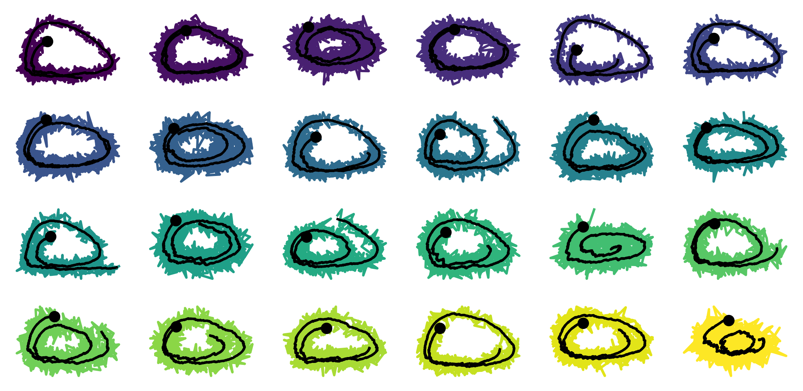
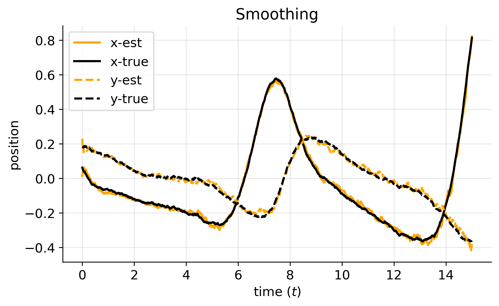
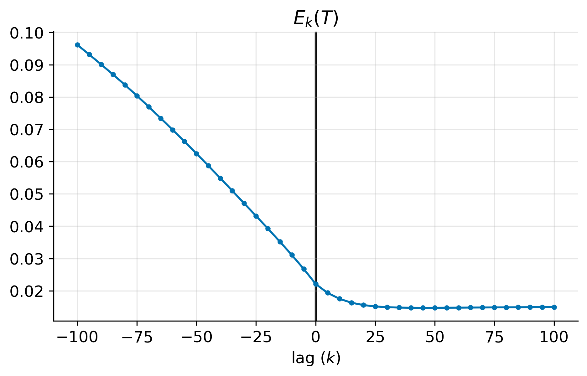

# Introduction
I was first introduced to the Kalman filter as a computationally-efficient way to
compute the posterior distribution over the latent (state) space given a sequence of measurables.
This is the perspective that I have been studying for a few years now.

A few months ago, however, I came across the "Kalman filter primer" book by Randall L. Eubank ---
a small, densely-packed, and zero-motivation book on the Kalman filter (KF) and
its derivation using only tools from linear algebra and basic concepts of statistics.
Despite the not-so-well received perception by some audience (it currently rates 2/5 stars in Amazon),
it contains some important lessons about how the KF is derived.
In particular, it was surprising to me to learn just how much we have to assume in order to derive the KF.
Moreover, that despite all these assumptions (many of which do not necessarily hold in practice),
the KF *just works*.

In these series of post, I summarise the most important lessons that I drew from the book.
Each post contains a section on the theory, some motivation on the decision that we make,
and a final example, where we put theory into practice.

## The first part
In this first post, I present signal-plus-noise models.
With few assumptions on the data generating process (DGP),
the best-linear-unbiased estimate for signals-plus-noise models is derived.
We then modify the result to make use of *innovations* to make the computation of the BLUP more efficient.
We then present filtering, smoothing, prediction, and fixed-lag-smoothing as computing the BLUP
on different timeframes.
This post concludes by introducing a data-driven-approach to compute the BLUP over varying timeframes.

# Signal plus noise models
The story of the Kalman filter begins with signal plus noise models.
A signal plus noise model assumes that a random process of *measurements*
$Y_{1:T} = (Y_1, \ldots, Y_T)$
can be written as the sum of two components:
a predictable process
$F_{1:T}$
and an unpredictable process
${E}_{1:T}$.
We assume $(Y_t, F_t, E_t) \in {\mathbb R}^{3\times d}$ for all
$t \in {\cal T} = \{1, \ldots, T\}$,
$d \geq 1$, and $T \gg d$.
By _predictable_, we mean that the that the covariance between the measurement and the signal is not (necessarily) non-diagonal.
By _unpredictable_, we mean that the covariance between the measurement and the noise is diagonal.
This means


$$
\begin{aligned}
    {\rm Cov}(Y_t, F_j) &\neq 0, \\
    {\rm Cov}(Y_t, E_j) &= \mathbb{1}(t = j)\,{\bf R}_t,
\end{aligned}
$$

for all $t,j \in {\cal T}$.
Here ${\bf R}_t$ is the  known covariance matrix of the noise process at time $t$, which is positive definite.

We write a signal-plus-noise process as

$$
\tag{S.1}
\underbrace{Y_{1:T}}_\text{measurement} =
    \underbrace{F_{1:T}}_{\text{signal}} + 
    \underbrace{{E}_{1:T}}_{\text{noise}}.
$$

Finally, suppose
$\mathbb{E}[F_t] = 0$ and
$\mathbb{E}[{E}_t] = 0$
for all $t \in {\cal T}$.
This assumption can be relaxed, but we keep this for sake of simplicity

<!-- We assume that running an experiment produces $y_{1:T}$, $f_{1:T}$, and $e_{1:T}$. -->
<!-- However, we only have access to the *measurements* $y_{1:T}$. -->

# The best-linear unbiased predictor (BLUP)
Denote by $y_{1:T}$ a sample of the measurement process $Y_{1:T}$.
Similarly, denote by $f_{1:T}$ and $e_{1:T}$ the samples of
the signal and the noise processes $F_{1:T}$ and $E_{1:T}$ respectively.
Suppose, $(j,t)\in{\cal T}^2$
and we are given a subset of the sampled measurements $y_{1:j} = (y_1, \ldots, y_j)$,
but we do not observe $f_{1:T}$ nor $e_{1:T}$.
We seek to find the matrix ${\bf A} \in \reals^{d\times j}$ that maps $y_{1:j}$
to the (unobserved) signal $f_t$. We write this *linear predictor* as

$$
    f_{t|j} =  {\bf A}\,y_{1:j}.
$$

That is, we want the matrix ${\bf A}$ that weights all observations up to time $j$
to make a prediction about the signal at time $t$.
Depending on the value of $j$ (a frame of reference) this estimate takes different names.
We come back to this point below.

For mathematical convenience,
our choice of ${\bf A}\in{\mathbb R}^{d\times j}$ is determined as the
matrix that minimises the expected L2 error
between the signal process $F_t$ and the *linear prediction process*
${\bf A}\,Y_{1:j}$.
Having found this matrix ${\bf A}$, the prediction ${\bf A}y_{1:t}$ is called
best linear unbiased predictor (BLUP).

We formalise thie idea in the proposition below.

### Proposition 1
Suppose, $(j,t)\in{\cal T}^2$.
Let $Y_{1:j}$ be a subset of the measurement process and $F_t$ be signal process at time $t$.
The linear mapping ${\bf A}$ that minimises the L2 error between the signal random variable $F_{t}$
and the subset of the measurement process $Y_{1:j}$ takes the form

$$
    {\bf A}_\text{opt}
    = \argmin_{\bf A}\mathbb{E}\left[\|F_t - {\bf A}\,Y_{1:j}\|^2\right]
    = {\rm Cov}(F_t, Y_{1:j})\,{\rm Var}(Y_{1:j})^{-1}.
$$

Then, the best linear unbiased predictor (BLUP) of the signal $F_t$ given $Y_{1:j}$
is given by

$$
\begin{aligned}
\tag{BLUP.1}
    F_{t|j}
    &= {\bf A}_\text{opt}\,Y_{1:j} \\
    &= {\rm Cov}(F_t, Y_{1:j})\,{\rm Var}(Y_{1:j})^{-1}\,Y_{1:j}.
\end{aligned}
$$


Then,
the error variance-covariance matrix of the BLUP is defined by

$$
\tag{EVC.1}
    \Sigma_{t|j} = {\rm Var}(F_t - F_{t|j}) =
    {\rm Var}(F_t) - {\bf A}_\text{opt}\,{\rm Var}(Y_{1:j})\,{\bf A}_\text{opt}^\intercal.
$$


For a proof, [see the Appendix]().


# The innovation process
Suppose that $d \ll j$, i.e., the dimension of the measurements is much lower than the number of timesteps $j$.
Then, computing ${\rm (BLUP.1)}$ requires $O(j^3)$ operations ---
this is because of the term ${\rm Var}(Y_{1:j})^{-1}$,
which is a $j\times j$ positive definite matrix that we have to invert at timeframe $j$.
To go around this computational bottleneck, we introduce the concept of an innovation,
which decorrelates measurements and allows for a more efficient computation of $(\text{BLUP.1})$.

Denote by
${\cal E}_t$
an innovation random variable and $\varepsilon_t$ a sample of the random variable.
The innovation random variable
${\cal E}_t$,
derived from the measurement random variable $Y_{t}$ and the innovation process 
${\cal E}_{1:t-1}$,
is defined by

$$
\tag{I.1}
    {\cal E}_t =
    \begin{cases}
        Y_1 & \text{for } t = 1,\\
        Y_t - \sum_{k=1}^{t-1} {\rm Cov}(Y_t, {\cal E}_k)\,{S}_k^{-1}\,{\cal E}_k & \text{for } t \geq 2,
    \end{cases}
$$

As we see, the innovation process
${\cal E}_{1:t}$
is built *sequentially*.

Innovations have multiple properties that allows the working
with $(\text{BLUP.1})$ much more tractable.
We provide some of these properties below.


### Proposition 2
Let $Y_{1:j}$ be a signal-plus-noise random process and
${\cal E}_{1:j}$ be the innovation process derived from $Y_{1:j}$.
Then,

$$
\tag{I.2}
    {\rm Cov}({\cal E}_t, {\cal E}_j)=
    \begin{cases}
    0 & \text{if } t\neq j,\\
    S_t & \text{if } t = j.
    \end{cases}
$$

with $S_j = {\rm Var}({\cal E}_j)$.

Furthermore, the measurement process and the innovation process satisfy the relationship

$$
\tag{I.3}
    Y_{1:j} = {\bf L}\,{\cal E}_{1:j},
$$

with ${\bf L}$ a lower-triangular matrix with elements

$$
\tag{I.4}
    {\bf L}_{t,j} =
    \begin{cases}
    {\rm Cov}(Y_t, {\cal E}_j)\,S_j^{-1} & \text{if } j < t, \\
    {\bf I} & \text{if } j = t, \\
    {\bf 0 } & \text{if } j > t.
    \end{cases}
$$


Finally, the variance of the measurement process satisfies

$$
\tag{I.5}
    {\rm Var}(Y_{1:T}) = {\bf L}\,{\bf S}\,{\bf L}^\intercal.
$$

The result above corresponds to the Cholesky decomposition of the variance matrix for the measurements.

For a proof, see [the Appendix]().

## Building an innovation sample

The terms $(\text{I.1})$ and $(\text{I.3})$ provide two ways to estimate a sample of innovations $\varepsilon_{1:j}$
given a sample of measurements $y_{1:j}$:
1. estimate $\varepsilon_t$ sequentially given $y_t$ and $\varepsilon_{1:t-1}$
following $(\text{I.1})$;
2. wait until we have access to $y_{1:T}$, and using ${\bf L}$, solve the system of linear equations
${\bf L}\,\varepsilon_{1:T} = y_{1:T}$ for the unknown vector $\varepsilon_{1:T}$, following $(\text{I.2})$.

Case 1. is *online* and case 2. is *offline*.

# The BLUP under innovations

## Proposition 3
Suppose we have access to innovations $\varepsilon_{1:j}$ derived from measurements $y_{1:j}$ for some $j\in{\cal T}$.
Let

$$
\tag{G.1}
    {\bf K}_{t,k} = {\rm Cov}(F_t, {\cal E}_k)\,S_k^{-1}  
$$

be the *gain* matrix for the signal $F_t$, given the innovation ${\cal E}_k$.

The BLUP of the signal $f_t$ given $\varepsilon_{1:j}$ can be written
as the sum of linear combinations of gain matrices and innovations:

$$
    \tag{BLUP.2}
    f_{t|j} = \sum_{k=1}^j {\bf K}_{t,k}\,\varepsilon_k.
$$

Furthermore, the error-variance covariance matrix of the BLUP takes the form

$$
\begin{aligned}
    \tag{EVC.2}
    {\rm Var}(f_t - f_{t|j})
    = {\rm Var}(f_t) - \sum_{k=1}^j {\bf K}_{t,k}\,S_k\,{\bf K}_{t,k}^\intercal.
\end{aligned}
$$


See [proof 3]() in the Appendix for a proof.


Equation $(\text{BLUP.2})$ highlights a key property when working with innovations in estimating the BLUP:
the number of computations to estimate $f_{t|j}$ becomes *linear* in time.
Furthermore, computing $(\text{BLUP.2})$ now requires $O(j d^3)$ operations.

# Filtering, prediction, smoothing, and fixed-lag smoothing
Recall that our quantity of interest takes the form $(\text{BLUP.2})$,
which is determined by our frame of reference $j$.
As a consequence, it determines the amount of information we have to make an estimate of the signal process.

In this section, we classify various BLUP estimates $f_{t|j}$ as a function of the frame of reference $j$.
As we will see, the choice of $j$ can serve different purposes.

## Filtering
The term filtering refers to the action of *filtering-out* the noise $e_t$ to estimate the signal $f_t$.
Filtering is defined as

$$
\tag{F.1}
    % f_{t | t} = \sum_{k=1}^t {\rm Cov}(f_t, \varepsilon_k)\,S_k^{-1}\,\varepsilon_k.
    f_{t | t} = \sum_{k=1}^t {\bf K}_{t,k}\,\varepsilon_k.
$$

This quantity is one of the most important in the signal-processing theory.
Given a run of the experiment ran up to time $t$, filtering produces (online) estimates of the signal $f_t$,
given the measurements $y_{1:t}$.

We exemplify filtering in the table below.
The top row shows the point in time in which the estimate is computed;
the *signal* row shows in $\color{#00B7EB}\text{cyan}$ the target signal that we seek to obtain from the measurement;
finally the bottom row shows in $\color{orange}\text{orange}$ the measurements to consider to estimate the BLUP.


$$
\begin{array}{c|ccccc}
\text{BLUP} & & & & f_{t|t} & & & \\
\text{signal} & f_{t-3} & f_{t-2} & f_{t-1} & \color{#00B7EB}{f_{t}} & f_{t+1} & f_{t+2} & f_{t+3}\\
\text{measurement} & \color{orange}{y_{t-3}} & \color{orange}{y_{t-2}} & \color{orange}{y_{t-1}} & \color{orange}{y_{t}} & y_{t+1} & y_{t+2} & y_{t+3}\\
\hline
\text{time} & t-3 & t-2 & t-1 & t & t+1 & t+2 & t+3
\end{array}
$$

As we see, filtering considers all measurements up to time $t$ to make an estimate of the signal at time $t$.

## Prediction
This quantity estimates the expected future signal $f_{t+i}$, given $y_{1:t}$.
Here, $i \geq 1.$

$$
\tag{F.2}
    % f_{t + i |t} = \sum_{k=1}^{t} {\rm Cov}(f_{t+1}, \varepsilon_k)\,S_k^{-1}\,\varepsilon_k.
    f_{t + i | t} = \sum_{k=1}^t {\bf K}_{t+i,k}\,\varepsilon_k.
$$ 



We exemplify a two-step-ahead prediction in the table below

$$
\begin{array}{c|ccccc}
\text{BLUP} & & & & f_{t+2|t} & & & \\
\text{signal} & f_{t-3} & f_{t-2} & f_{t-1} & f_{t} & f_{t+1} & \color{#00B7EB}{f_{t+2}} & f_{t+3}\\
\text{measurement} & \color{orange}{y_{t-3}} & \color{orange}{y_{t-2}} & \color{orange}{y_{t-1}} &  \color{orange}{y_{t}} & y_{t+1} & y_{t+2} & y_{t+3}\\
\hline
\text{time} & t-3 & t-2 & t-1 & t & t+1 & t+2 & t+3
\end{array}
$$

As shown in the table above, a two-step-ahead prediction at time $t$ considers all measurements up to time $t$ to
make an estimate of the signal at time $t+2$.

## Smoothing
This quantity refers to the estimate of $f_t$ having observed a full run of the experiment $y_{1:T}$.
Contrary to the filtering equation $(\text{F.1})$, which is *online*, the smoothing operation
waits until all measurements have been observed to make an estimate of the signal.
We define the smoothing operation as

$$
\tag{F.3}
    % f_{t | T} = \sum_{k=1}^T {\rm Cov}(f_t, \varepsilon_k)\,S_k^{-1}\,\varepsilon_k.
    f_{t | T} = \sum_{k=1}^T {\bf K}_{t,k}\,\varepsilon_k.
$$


We exemplify smoothing at time $t$ in the table below

$$
\begin{array}{c|ccccc}
\text{BLUP} & & & & & & & f_{t|T} \\
\text{signal} & f_{t-3} & f_{t-2} & f_{t-1} & \color{#00B7EB}{f_{t}} & f_{t+1} & \ldots & f_T\\
\text{measurement} & \color{orange}{y_{t-3}} & \color{orange}{y_{t-2}} & \color{orange}{y_{t-1}}
                   & \color{orange}{y_{t}} & \color{orange}{y_{t+1}} & \ldots & \color{orange}{y_{T}}\\
\hline
\text{time} & t-3 & t-2 & t-1 & t & t+1 & \ldots & T
\end{array}
$$

We observe that smoothing requires all information up to time $T$ to make an estimate of the signal at time $t$.
In this sense, smoothing is *offline*.
There is a more computationally-efficient way to estimate ($F.3$),
which we will see in a later post.


## Fixed-lag smoothing
This quantity is a middle ground between the filtering, which is *online*, and smoothing, which is *offline*.
The idea behind an $i$-step fixed-lag smoother is to estimate the signal $f_t$ after observing $y_{1:t+i}$.
That is, we must wait $i$ steps, before making an estimate of the signal $f_t$.

$$
\tag{F.4}
    % f_{t | t + i} = \sum_{k=1}^{t+i} {\rm Cov}(f_t, \varepsilon_k)\,S_k^{-1}\,\varepsilon_k.
    f_{t | t + i} = \sum_{k=1}^{t+i} {\bf K}_{t,k}\,\varepsilon_k.
$$


We exemplify a two-step fixed-lag smoothing below

$$
\begin{array}{c|ccccc}
\text{BLUP} & & & & & & f_{t|t+2} & \\
\text{signal} & f_{t-3} & f_{t-2} & f_{t-1} & \color{#00B7EB}{f_{t}} & f_{t+1} & f_{t+2} & f_{t+3}\\
\text{measurement} & \color{orange}{y_{t-3}} & \color{orange}{y_{t-2}} & \color{orange}{y_{t-1}} & \color{orange}{y_{t}}
                   & \color{orange}{y_{t+1}} & \color{orange}{y_{t+2}} & y_{t+3}\\
\hline
\text{time} & t-3 & t-2 & t-1 & t & t+1 & t+2 & t+3
\end{array}
$$

We observe that we require information up to time $t+2$ to make a prediction of the signal at time $t$.

---

# Example: a data-driven BLUP
In this example, we consider a data-driven approach to estimate the BLUP at multiple timesteps.
We divide this experiment into a *train phase* where the quantities
${\rm Cov}(F_t, {\cal E}_k)$,
${\rm Cov}(Y_t, {\cal E}_k)$,
$S_k$, and
${\bf L}$
are found;
and a *test phase* where the BLUP estimates $(\text{F.1 -- F.4})$
are are obtained from measurement $y_{1:T}$ not seen in the train phase.

For this experiment, we make use of the `numpy` library, which includes the einsum operator,
and the `einops` library.
For a review of `np.einsum` see the post
[einsums in the wild]().


## Noisy Lotka-Volterra model
Consider the following signal-plus-noise model

$$
\tag{LV.1}
\begin{aligned}
    \frac{f_{t + \Delta, 1} - f_{t, 1}}{\Delta} &= \alpha\,f_{t,1} - \beta\,f_{t,1}\,f_{t,2} + \phi_{t,1},\\
    \frac{f_{t + \Delta, 2} - f_{t, 2}}{\Delta} &= \delta\,f_{t,1}\,f_{t,2} - \gamma\,f_{t,2} + \phi_{t, 2},\\
    y_{t  + \Delta, 1} &= f_{t + \Delta, 1} + \varphi_{t,1},\\
    y_{t  + \Delta, 2} &= f_{t + \Delta, 2} + \varphi_{t,2},
\end{aligned}
$$


with
$\phi_{t,i} \sim {\cal N}(0, \sigma_f^2 / \Delta)$,
$\varphi_{t,j} \sim {\cal N}(0, \sigma_y^2)$,
$(i,j) \in \{0,1\}^2$,
$\sigma_f^2, \sigma_y^2 > 0$,
$\Delta \in (0, 1)$, and
$\alpha, \beta, \gamma, \delta$ values in the interval $(0,1)$.

## The setup
Consider samples of the sytem $(\text{LV.1})$ above with the following parameters:
$\alpha = 2/3$,
$\beta = 4/3$,
$\gamma = 0.8$,
$\delta = 1.0$,
$\Delta = 0.01$,
$\sigma_f^2 = 0.02^2$, and
$\sigma_y^2 = 0.1^2$.
We integrate the system for $T=1500$ steps, each starting at $(f_{0,1}, f_{0,2}) = (1.0, 1.0) + (u_1, u_2)$,
with $u_i \sim \cal{U}[-0.2, 0.2]$.

The following plot shows multiple samples of of this process.
The black line shows the signal $(f_{t,1}, f_{t,2})$ and the coloured line shows the measurements $(y_{t,1}, y_{t,2})$
for $t=1, \ldots, T.$



## Train phase
In the train phase, we consider 2000 samples of $(\text{LV.1})$ following the configuration outlined above.
To enforce the constraint, $\mathbb{E}[f_t] = 0$, we *de-mean* the samples.
For this section, we assume we have a numpy array of measurements `y_sims` and a numpy array of signals `f_sims`
with `f_sims.shape == y_sims.shape == (1500, 2, 2000)`
corresponding to the 1500 steps of the process, two dimensions, and 2000 samples.

### Computation of innovations
We begin by estimating the matrix ${\bf L}$. Recall from $(\text{I.3})$ that
${\rm Var}(Y_{1:T}) = {\bf L}\,{\bf S}\,{\bf L}^\intercal$.
This can be estimated in einsum form as
```
V = np.einsum("tds,kds->dtk", y_sims, y_sims) / (n_sims - 1)
```
Next, the terms ${\bf L}$ and ${\bf S}$ are estimated by
```
L = np.linalg.cholesky(V)
S = np.einsum("dtt->dt", L)
L = np.einsum("dtk,dk->dtk", L, 1 / S)
S = S ** 2
```

Finally, the innovations derived from the samples `y_sims` are estimated by
```
ve_sims = np.linalg.solve(L, einops.rearrange(y_sims, "t d s -> d t s"))
ve_sims = einops.rearrange(ve_sims, "d t s -> t d s")
```
This corresponds to $(\text{I.2})$.

### Computation of the gain matrices
For the gain matrices, we obtain

$$
\begin{aligned}
    {\bf K}_{t,k}
    &= {\rm Cov}(F_t, {\cal E}_k)\,S_k^{-1}\\
    &= {\rm Cov}(F_t, {\cal E}_k)\,{\rm Var}({\cal E}_k)^{-1}\\
    &\approx\left(\frac{1}{S}\sum_{s=1}^S\left(f_t^{(s)} - \bar{f}_t\right)\,\left(\varepsilon_k^{(s)} - \bar{\varepsilon}_k\right)^\intercal\right)\,S_k^{-1}
\end{aligned}
$$


This quantity is estimated by
```
K = np.einsum("tds,kds,dk->tkd", f_sims, ve_sims, 1 / S) / (n_sims - 1)
```
The following Figure shows the gain matrices ${\bf K}_{t,k,i}$ for $i=1,2$, corresponding to the $x$ and $y$ coordinates
of the process.


We observe that in each panel, the values below the diagonal have non-zero values for $K_{t,k,i}$,
whereas values above the diagonal are mostly zero.
This suggests that, for any two points in time $t$ and $k$, with $t$ being the *target* index and $k$ the
frame of reference, having $k < t$ provides information to the estimate of $t$.
Conversely, the information from $k > t$ is almost none.

## Test phase
Having computed `K` and `L`, we are now able to evaluate the BLUP estimates $(\text{F.1 -- F.4})$
on an unseen run `ve_test_sim` with `ve_test_sim.shape == (1500, 2)`.


### Filter

```
tmask = np.tril(np.ones((T, T)), k=0)
latent_filter = np.einsum("tkd,kd,tk->td", K, ve_test_sim, tmask)
```


### Smoothing
```
latent_smooth = np.einsum("tkd,kd->td", K, ve_test_sim)
```


### Prediction
```
tmask = np.tril(np.ones((n_steps, n_steps)), k=-5)
latent_pred = np.einsum("tkd,kd,tk->td", K, ve_test_sim, tmask)
```


### Varying lag



---

# Appendix

### Proof of proposition 1
Here, we provide a detailed proof of [Proposition 1]().
Let

$$
    {\cal L}({\bf A}) = \mathbb{E}\left[\|F_t - {\bf A}\,Y_{1:j}\|^2\right].
$$

Then,

$$
\begin{aligned}
    \nabla_{\bf A}\,{\cal L}({\bf A})
    &= 2\,\mathbb{E}\left[(F_t - {\bf A}\,Y_{1:j})\,Y_{1:j}^\intercal\right]\\
    &= 2\,\left( \mathbb{E}\left[F_t\,Y_{1:j}^\intercal\right]-\mathbb{E}[{\bf A}\,Y_{1:j}\,Y_{1:j}^\intercal]\right)\\
    &= 2\,\left( \mathbb{E}\left[F_t\,Y_{1:j}^\intercal\right]-{\bf A}\,\mathbb{E}[Y_{1:j}\,Y_{1:j}^\intercal]\right)\\
    &= 2\,\left( {\rm Cov} (F_t, Y_{1:j}) - {\bf A}\,{\rm Var}(Y_{1:j})\right)
\end{aligned}
$$

Setting this last equality to zero and solving for ${\bf A}$ recovers
${\bf A}_\text{opt} = {\rm Cov} (F_t, Y_{1:j})\,{\rm Var}(Y_{1:j})^{-1}$
above.

Next, for the error variance-covariance matrix, we have

$$
\begin{aligned}
    \Sigma_{t|j}
    &= {\rm Var}(F_t - F_{t|j})\\
    &= \mathbb{E}\left[(F_t - F_{t|j})(F_t - F_{t|j})^\intercal\right]\\
    &= \mathbb{E}\left[F_tF_t^\intercal - F_tF_{t|j}^\intercal - F_{t|j}F_t^\intercal + F_{t|j}F_{t|j}^\intercal\right]\\
    &= \mathbb{E}\left[F_tF_t^\intercal - F_t({\bf A}_\text{opt}Y_{1:j})^\intercal -
    {\bf A}_\text{opt}Y_{1:j}F_t^\intercal + {\bf A}_\text{opt}Y_{1:j}Y_{1:j}^\intercal{\bf A}_\text{opt}\right]\\
    &= {\rm Var}(F_t) - {\rm Cov}(F_t, Y_{1:j}){\bf A}_\text{opt}^\intercal - {\bf A}_\text{opt}{\rm Cov}(Y_{1:j}, F_t)
    + {\bf A}_\text{opt}{\rm Var}(Y_{1:j}){\bf A}_\text{opt}^\intercal\\
    &= {\rm Var}(F_t)
    - {\rm Cov}(F_t, Y_{1:j}){\rm Var}(Y_{1:j})^{-1}{\rm Var}(Y_{1:j}){\bf A}_\text{opt}^\intercal\\
    &\quad- {\bf A}_\text{opt}{\rm Var}(Y_{1:j})\left[{\rm Cov}(F_t, Y_{1:j}){\rm Var}(Y_{1:j})^{-1}\right]^\intercal\\
    &\quad + {\bf A}_\text{opt}{\rm Var}(Y_{1:j}){\bf A}_\text{opt}^\intercal\\
    &= {\rm Var}(F_t) - {\bf A}_\text{opt}{\rm Var}(Y_{1:j}){\bf A}_\text{opt}^\intercal.
\end{aligned}
$$

Where the last line follows from the definition of ${\bf A}_\text{opt}$.
 $$ \ \tag*{$\blacksquare$} $$ 

### Proof of proposition 2
Here, we provide a proof of [Proposition 2]().

#### Proof of (I.2)
To show $(\text{I.2})$, first note that the diagonal terms
${\rm Cov}({\cal E}_t, {\cal E}_t) = {\rm Var}({\cal E}_t) = S_t$
for all $t \in {\cal T}$.

Next, we show that the off-diagonal terms are zero.
Observe that

$$
\begin{aligned}
    &{\rm Cov}({\cal E}_1, {\cal E}_2)\\
    &= {\rm Cov}\Big(Y_1,\,Y_2 - {\rm Cov}(Y_2,\,{\cal E}_1)S_1^{-1}{\cal E}_1\Big)\\
    &= {\rm Cov}(Y_1,\,Y_2) - {\rm Cov}\Big(Y_1,\,{\rm Cov}(Y_2,\,{\cal E}_1)S_1^{-1}{\cal E}_1\Big)\\
    &= {\rm Cov}(Y_1,\,Y_2) - {\rm Cov}\Big(Y_1,\,{\rm Cov}(Y_2,\,Y_1)S_1^{-1}Y_1\Big)\\
    &= {\rm Cov}(Y_1,\,Y_2) - {\rm Cov}(Y_1, Y_1)S_1^{-1}{\rm Cov}(Y_1\,Y_2)\\
    &= {\rm Cov}(Y_1,\,Y_2) - S_1\,S_1^{-1}{\rm Cov}(Y_1\,Y_2)\\
    &= 0.
\end{aligned}
$$

By symmetry of the covariance matrix, we obtain
${\rm Cov}({\cal E}_2,\,{\cal E}_1) = ({\rm Cov}({\cal E}_1,\,{\cal E}_2))^\intercal = 0$.
A similar procedure shows that
${\rm Cov}({\cal E}_1, {\cal E}_3) = {\rm Cov}({\cal E}_3, {\cal E}_1) = 0$.
The general case holds by induction:

Suppose that

$$
    {\rm Cov}({\cal E}_i, {\cal E_{j-1}}) = 0 \ \text{for } i\geq 2,\,j-1=i+1,\ldots,T-1.
$$

i.e., an upper-triangular (off-diagonal) assumption.
We show
${\rm Cov}({\cal E}_i, {\cal E}_j) = 0$.
By definition,

$$
\begin{aligned}
    &{\rm Cov}({\cal E}_i,\,{\cal E}_j)\\
    &= {\rm Cov}\left({\cal E}_i,\,Y_j - \sum_{k=1}^{j-1}{\rm Cov}(Y_j, {\cal E}_k)S_k^{-1}{\cal E}_k\right)\\
    &= {\rm Cov}\left({\cal E}_i,\,Y_j -
    \sum_{\substack{k\neq i \\ {1 \leq k\leq j-1}}}{\rm Cov}(Y_j,\,{\cal E}_k)S_k^{-1}{\cal E}_k
    - {\rm Cov}(Y_j,\,{\cal E}_i)S_i^{-1}{\cal E}_i
    \right)\\
    &...
\end{aligned}
$$


#### Proof of (I.3)
Next, we show $(\text{I.3})$.
By definition, the innovation at time $t$ is

$$
    {\cal E}_t = Y_t - \sum_{k=1}^{t-1}{\rm Cov}(Y_t, {\cal E}_k)\,{\bf S}_k^{-1}\,{\cal E}_j
$$

Define the lower triangular matrix ${\bf L}$ as in $(\text{I.4})$.
Then

$$
\begin{aligned}
    {\cal E}_t
    &= Y_t - \sum_{k=1}^{t-1}{\bf L}_{t,k}\,{\cal E}_k\\
    &= Y_t + {\bf L}_{t,t}\,{\cal E}_t - {\bf L}_{t,t}\,{\cal E}_t - \sum_{k=1}^{t-1}{\bf L}_{t,k}\,{\cal E}_k\\
    &= Y_t + {\bf L}_{t,t}\,{\cal E}_t - \sum_{k=1}^{t}{\bf L}_{t,k}\,{\cal E}_k\\
    &= Y_t + {\cal E}_t - \sum_{k=1}^{t}{\bf L}_{t,k}\,{\cal E}_k.
\end{aligned}
$$

The last equality corresponds to the $t$-th entry of the vector resulting form the matrix-vector multiplication
$({\bf L}\,{\cal E}_{1:T})_t$.
So that
${\cal E}_t = Y_t + {\cal E}_t - ({\bf L}\,{\cal E}_{1:T})_t$.
Then, we can write innovation vector as

$$
\begin{aligned}
    &{\cal E}_{1:T} = Y_{1:T} + {\cal E}_{1:T} - {\bf L}\,{\cal E}_{1:T}\\
    \iff & 0 = Y_{1:T} - {\bf L}\,{\cal E}_{1:T}\\
    \iff & Y_{1:T} = {\bf L}\,{\cal E}_{1:T}.
\end{aligned}
$$


#### Proof of (I.5)
Finally, to show $(\text{I.5})$, note that

$$
\begin{aligned}
    {\rm Var}(Y_{1:t})
    &= {\rm Var}({\bf L}\,{\cal E}_{1:T})\\
    &= {\rm Cov}({\bf L}\,{\cal E}_{1:T}, {\bf L}\,{\cal E}_{1:T})\\
    &= {\bf L}\,{\rm Cov}({\cal E}_{1:T}, {\cal E}_{1:T}){\bf L}^\intercal\\
    &= {\bf L}\,{\rm Var}({\cal E}_{1:T}){\bf L}^\intercal\\
    &= {\bf L}\,{\bf R}\,{\bf L}^\intercal.
\end{aligned}
$$

Because ${\bf L}$ is a lower triangular matrix, it follows that the last equality corresponds to the Cholesky
cholesky decomposition of ${\rm Var}(Y_{1:T})$
 $$ \ \tag*{$\blacksquare$} $$ 


### Proof of proposition 3
Here, we provide a detailed proof of [Proposition 3]().
Using $(\text{BLUP.1})$ and $(\text{I.2})$, we see that

$$
\begin{aligned}
    {\bf A}_\text{opt}
    &= {\rm Cov}(F_t, Y_{1:j})\,{\rm Var}(Y_{1:j})^{-1}\\
    &= {\rm Cov}(F_t, {\bf L}\,{\cal E}_{1:j})\,{\rm Var}({\bf L}\,{\cal E}_{1:j})^{-1}\\
    &= {\rm Cov}(F_t, {\cal E}_{1:j})\,{\bf L}^\intercal\,\{{\bf L}{\rm Var}({\cal E}_{1:j}){\bf L}^\intercal\}^{-1}\\
    &= {\rm Cov}(F_t, {\cal E}_{1:j})\,{\bf L}^\intercal\,{\bf L}^{-\intercal}\, {\rm Var}({\cal E}_{1:j})^{-1}{\bf L}^{-1}\\
    &= {\rm Cov}(F_t, {\cal E}_{1:j})\, {\rm Var}({\cal E}_{1:j})^{-1}{\bf L}^{-1}\\
    &= {\rm Cov}(F_t, {\cal E}_{1:j})\, {\rm Diag}(S_1, \ldots, S_j)^{-1}{\bf L}^{-1}.
\end{aligned}
$$

Then, the BLUP of the signal $f_t$ given $y_{1:j}$ is

$$
\begin{aligned}
    f_{t|j}
    &= {\bf A}_\text{opt}\,y_{1:j}\\
    &= {\rm Cov}(F_t, Y_{1:j})\,{\rm Var}(Y_{1:j})^{-1}\,y_{1:j}\\
    &= {\rm Cov}(F_t, {\cal E}_{1:j})\, {\rm Diag}(S_1, \ldots, S_j)^{-1}{\bf L}^{-1}\,{\bf L}\,\varepsilon_{1:j}\\
    &= {\rm Cov}(F_t, {\cal E}_{1:j})\, {\rm Diag}(S_1, \ldots, S_j)^{-1}\,\varepsilon_{1:j}\\
    &= \sum_{k=1}^j {\rm Cov}(F_t, {\cal E}_k)\,S_k^{-1}\,\varepsilon_k\\
    &= \sum_{k=1}^j {\bf K}_{t,k}\,\varepsilon_k.
\end{aligned}
$$


Furthermore, the error variance-covariance matrix of the BLUP takes the form

$$
\begin{aligned}
    &{\rm Var}(F_t - F_{t|j})\\
    &= {\rm Var}(F_t) - {\bf A}_\text{opt}\,{\rm Var}\,(Y_{1:j})\,{\bf A}_\text{opt}^\intercal\\
    &= {\rm Var}(F_t) -
    {\rm Cov}(F_t, {\cal E}_{1:j})\, {\rm Var}({\cal E}_{1:t})^{-1}{\bf L}^{-1}
    \{{\bf L}{\rm Var}({\cal E}_{1:j}){\bf L}^\intercal\}
    \left({\rm Cov}(F_t, {\cal E}_{1:j})\, {\rm Var}({\cal E}_{1:t})^{-1}{\bf L}^{-1}\right)^\intercal\\
    &= {\rm Var}(F_t) -
    {\rm Cov}(F_t, {\cal E}_{1:j})\, {\rm Var}({\cal E}_{1:t})^{-1}{\bf L}^{-1}
    {\bf L}{\rm Var}({\cal E}_{1:j}){\bf L}^\intercal
    \left({\rm Cov}(F_t, {\cal E}_{1:j})\, {\rm Var}({\cal E}_{1:t})^{-1}{\bf L}^{-1}\right)^\intercal\\
    &= {\rm Var}(F_t) -
    {\rm Cov}(F_t, {\cal E}_{1:j})\, {\rm Var}({\cal E}_{1:t})^{-1}{\bf L}^{-1}
    {\bf L}{\rm Var}({\cal E}_{1:j}){\bf L}^\intercal\,
    {\bf L}^{-\intercal}\,{\rm Var}({\cal E}_{1:t})^{-1}\,{\rm Cov}({\cal E}_{1:j}, F_t)\\
    &= {\rm Var}(F_t) -
    {\rm Cov}(F_t, {\cal E}_{1:j})\, {\rm Var}({\cal E}_{1:t})^{-1}{\rm Var}({\cal E}_{1:j})\,
    {\rm Var}({\cal E}_{1:t})^{-1}\,{\rm Cov}({\cal E}_{1:j}, F_t)\\
    &= {\rm Var}(F_t) -
    {\rm Cov}(F_t, {\cal E}_{1:j})\, {\rm diag}(S_1, \ldots, S_j)^{-1}
    {\rm diag}(S_1, \ldots, S_j)\,
    {\rm diag}(S_1, \ldots, S_j)^{-1}\,{\rm Cov}({\cal E}_{1:j}, F_t)\\
    &= {\rm Var}(F_t) - \sum_{k=1}^j{\rm Cov}(F_t, {\cal E}_k)\,S_k^{-1}S_k\,S_k^{-1}\,{\rm Cov}({\cal E}_k, F_t)\\
    &= {\rm Var}(F_t) - \sum_{k=1}^j \left({\rm Cov}(F_t, {\cal E}_k)\,S_k^{-1}\right)S_k\,\left({\rm Cov}(F_t, {\cal E}_k)\,S_k^{-1}\right)^\intercal\\
    &= {\rm Var}(F_t) - \sum_{k=1}^j {\bf K}_{t,k}\,S_k\,{\bf K}_{t,k}^\intercal.
\end{aligned}
$$

 $$ \ \tag*{$\blacksquare$} $$ 