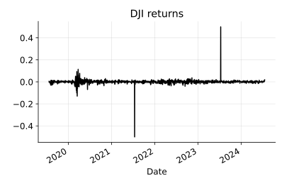
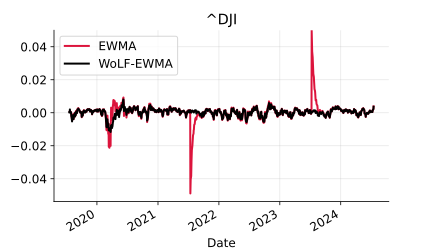
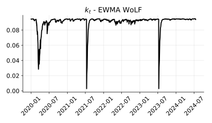

Our [weighted-observation likelihood filter (WolF)](https://arxiv.org/abs/2405.05646) got accepted at ICML 2024.
Our method *robustifies* the Kalman filter (KF)
by replacing the classical Gaussian likelihood assumption with a loss function.
As we show, this modification results in a provably-robust and easy-to-implement variant of the KF.

Despite its simplicity, the terminology behind WoLF (similar to the terminology of the KF), might not be familiar to everyone
and the method might seem a bit abstract for newcomers.
Thus, to show the practical utility of our method, in this post,
we apply the WoLF algorithm to a unidimensional state-space model (SSM) with unit (unobserved) signal and observation coefficients.
As we will see, the result is a variant of an algorithm that is familar to most: the exponentially weighted moving average (EWMA).

The rest of this post is organised as follows:
first, we recap the EWMA.
Then, we introduce the unidimensional SSM with unit (unobserved) signal and observation coefficients
and show that the EWMA is a special case of the KF in this setting.
Next, we derive the WoLF method for an EWMA.
We conclude this post by showing a numerical experiment that
illustrates the robustness of the WoLF method in corrupted one-dimensional financial data.

# The exponentially weighted moving average (EWMA)
Given a sequence of observations (or measurements) $y_{1:t} = (y_1, \ldots, y_t)$,
the EWMA of the observations at time $t$ is given by

$$
m_t = \beta\,y_t + (1-\beta)\,m_{t-1},
\tag{1}
$$

where $\beta \in (0,1]$ is the smoothing factor.
Higher levels of $\beta$ give more weight to recent observations.

# The Kalman filter in one dimension
Consider the following one-dimensional SSM:

$$
\begin{aligned}
z_t &= z_{t-1} + w_t,\\
y_t &= z_t + e_t,
\end{aligned}
\tag{2}
$$

where $z_t$ is the (unobserved) signal, $w_t$ is the process noise, and $e_t$ is the observation noise.
We assume that ${\rm var}(w_t) = q_t$ and ${\rm var}(e_t) = r_t$.[^1]
Put simply, the SSM model $(2)$ assumes that the observations $y_t$ are generated by a (unobserved) signal $z_t$ plus noise $e_t$.
The (unobserved) signal $z_t$ evolves over time according to a random walk with noise $w_t$
and the observations $y_t$ are generated by the (unobserved) signal $z_t$ plus noise $e_t$.

Our aim is to estimate the expected (unobserved) signal $z_t$ given the observations $y_{1:t}$.

$$
m_t = \mathbb{E}[z_t \vert y_{1:t}] = \int z_t\,p(z_t \vert y_{1:t}) dz_t,
\tag{4}

$$
where $\mathbb{E}[\cdot]$ denotes the expectation operator.

More generally, we are interested in estimating the *posterior* distribution $p(z_t \vert y_{1:t})$,
which we compute recursively using Bayes' rule.
Consider the initial density $p(z_0) = {\cal N}(z_0 \vert m_0, s_0)$ and
the likelihood $p(y_t \vert z_t) = {\cal N}(y_t \vert z_t, r_t^2)$,
with ${\cal N}(\cdot \vert \mu, \sigma^2)$ a Gaussian density with mean $\mu$ and variance $\sigma^2$.
The posterior density $p(z_t \vert y_{1:t})$ is given by

$$
\begin{aligned}
p(z_t \vert y_{1:t}) &\propto p(y_t \vert z_t)\,p(z_t \vert y_{1:t-1})\\
&= {\cal N}(z_t \vert m_t, s_t^2),
\end{aligned}
\tag{5}
$$

with

$$
\begin{aligned}
k_t &= \frac{s_{t-1}^2 + q_t^2}{s_{t-1}^2 + q_t^2 + r_t^2},\\
s_t^2 &= k_t\,r_t^2,\\
m_t &= k_t\,y_t + (1-k_t)\,m_{t-1}.
\end{aligned}
\tag{6}
$$

Computing the elements in $(6)$ correspond to the prediction steps of the Kalman filter.
Hence, from a probabilistic perspective, application of the Kalman filter to the SSM $(2)$
is equivalent to using Baye's rule to estimate the posterior distribution $p(z_t \vert y_{1:t})$ in a recursive manner.
Furthermore, we see that the KF applied to the SSM in $(2)$ is equivalent to the EWMA with $\beta$ replaced by $k_t$,
i.e., **the KF is an EWMA with a time-varying smoothing factor**.
We defer the derivation of $(6)$ to the appendix.

The KF formulation of the EWMA
(i) provides a principled way to determine the smoothing factor $k_t$,
(ii) provides a way to estimate the uncertainty of the (unobserved) signal $z_t$, and
(iii) it allows us to derive the WoLF variant for the EWMA.
We do this in the next section.


# The WoLF method for the EWMA
To create a 1D version of WoLF, recall that WoLF replaces the $r_t$ in the KF equations $(6)$
for $r_t^2 = r^2 / w_t^2$ with $w_t: \mathbb{R} \to \mathbb{R}$ a weight function.
Intuitively, the weight function $w_t$ determines degree of certainty that $y_t$ is an outlier.

Following the WolF paper, in this post, we consider the IMQ weight function

$$
w_t = \left(1 + \frac{(y_t - m_{t-1})^2}{c^2}\right)^{-1/2},
\tag{8}
$$

where $c > 0$ is the soft threshold.

Next, consider the SSM $(2)$ with $q_t^2 = q^2$ and $r_t^2 = r^2 / w_t^2$. Here $q \geq 0$ and $r > 0$ are fixed hyperparameters.
With these assumptions, the rate $k_t$ in $(6)$ for WoLF becomes

$$
k_t = \frac{s_{t-1}^2 + q^2}{s_{t-1}^2 + q^2 + r^2 / w_t^2}.
\tag{9}
$$

As a consequence, we obtain that, as $y_t \to \infty$,
the rate $k_t$ converges to $0$ faster than $y_t$ tends to $\infty$.
We obtain

$$
(m_t \to m_{t-1} \text{ and } s_t^2 \to s_{t-1}^2) \text{ as } y_t \to \infty.
\tag{10}
$$

In other words, with 1D Wolf, large and unexpected errors get discarded.
The larger the error, the less information it provides to the estimate $m_t$.

The WoLF EWMA is then computed using

$$
\begin{aligned}
k_t &= \frac{s_{t-1}^2 + q^2}{s_{t-1}^2 + q^2 + r^2 / w_t^2},\\
s_t^2 &= k_t\,r_t^2,\\
m_t &= k_t\,y_t + (1-k_t)\,m_{t-1}.
\end{aligned}
\tag{11}
$$



# Numerical experiments
Here, we provide a numerical example of the WoLF method for *smoothing* observations that are corrupted with outliers.
The next block of code defines the IMQ weight function $(8)$ and the WoLF method $(11)$ for the EWMA
using Python and the Numba library.
```python
import numpy as np
from numba import njit

@njit
def imq(err, c):
    return 1 / np.sqrt(1 + err ** 2 / c)

@njit
def wolf_step(y, m, s, q, r, c):
    # weight function and rate
    wt = imq(y - m, c) ** 2
    k = (s + q) / (s + q + r / wt ** 2)
    # posterior mean and variance
    m = k * y + (1 - k) * m
    s = k * r
    return m, s

@njit
def wolf1d(y, m0, s0, q, r, c):
    m = m0
    s = s0
    m_hist = np.zeros_like(y)
    s_hist = np.zeros_like(y)
    for t, yt in enumerate(y):
        m, s = wolf_step(yt, m, s, q, r, c)
        m_hist[t] = m
        s_hist[t] = s
    return m_hist, s_hist
```

Next, we consider data from the Dow Jones Industrial Average (DJI) from 2020 to 2024.
Suppose that we want to estimate the EWMA of the DJI on-line.
Suppose also that the data is corrupted with outliers and we do know 
in advance the level of corruption.
The following plot shows the DJI returns from 2020 to 2024 with outliers.



If we were to run this data through a standard EWMA, the result would be a biased estimate of the DJI signal
when the outliers are present.
However, EWMA with WoLF `c=0.05` ignores the outliers and provides a more accurate estimate of the DJI signal.
We show a comparison of the EWMA and the WoLF EWMA in the following plot.



We observe that the WoLF EWMA closely resembles the EWMA of the DJI signal and is less affected by the outliers.
 Another way to visualize the robustness of the WoLF method is to plot the rate $k_t$
 (which is the smoothing factor of the EWMA) as a function of time.


We observe that the rate $k_t$ is fairly stable, however, it decreases when the observation $y_t$ is is unusually large.


# Conclusion
In this post, we showed that the EWMA is a special case of the Kalman filter in a one-dimensional state-space model
with unit (unobserved) signal and measurement coefficients.
We derived the WoLF method for the EWMA and showed that it is a robust variant of the EWMA because it ignores large and unexpected errors. 
The code for this post is available in [this notebook](https://github.com/gerdm/misc/blob/f90e3eed65069dcee19db3606c1103af56df2f0b/2024-07/wolf-ewma.ipynb)

[^1]: There are more assumptions in the SSM $(2)$ that we have not mentioned here,
but the reader can find them in Eubank's 2005 book on SSMs.

# Aknowledgements
I would like to thank Leandro Sanchez-Betancourt and Danni Shi for their helpful comments on this post.

----
# Appendix
## Derivation of the 1d Kalman filter equations
Here, we derive the Kalman filter equations $(6)$ for the SSM $(2)$.
Suppose $p(z_0) = {\cal N}(z_0 \vert m_0, s_0)$.
Consider
$p(z_{t-1} \vert y_{1:t-1}) = {\cal N}(z_{t-1} \vert m_{t-1}, s_{t-1})$ and
$p(y_t \vert z_t) = {\cal N}(y_t \vert z_t, r_t)$.
Then, the prediction step is given by

$$
\begin{aligned}
p(z_t \vert y_{1:t-1}) &= \int p(z_t \vert z_{t-1})\,p(z_{t-1} \vert y_{1:t-1})\,dz_{t-1}\\
&= \int {\cal N}(z_t \vert z_{t-1}, q_t)\,{\cal N}(z_{t-1} \vert m_{t-1}, s_{t-1})\,dz_{t-1}\\
&= {\cal N}(z_t \vert m_{t-1}, s_{t-1} + q_t)\\
&= {\cal N}(z_t \vert m_{t-1}, s_{t|t-1}),
\end{aligned}
$$

with $s_{t|t-1} = s_{t-1} + q_t$.

Next, we consider the update step.
We have

$$
\begin{aligned}
p(z_t \vert y_{1:t})
&\propto p(y_t \vert z_t)\,p(z_t \vert y_{1:t-1})\\
&= {\cal N}(y_t \vert z_t, r_t^2)\,{\cal N}(z_t \vert m_{t-1}, s_{t-1} + q_t^2).
\end{aligned}
$$

To compute the posterior, consider the log-posterior function

$$
\begin{aligned}
\log p(z_t \vert y_{1:t})
&= -\frac{1}{s_{t|t-1}^2}(z_t - m_{t-1})^2 - \frac{1}{r_t^2}(y_t - z_t)^2 + \text{const}.\\
&= -\frac{1}{s_{t|t-1}}(z_t ^ 2 - 2z_t m_{t-1} + m_{t-1}^2) - \frac{1}{r_t^2}(y_t^2 - 2y_t z_t + z_t^2) + \text{const}.\\
&= -\frac{1}{s_{t|t-1}}(z_t^2 - 2z_tm_{t-1}) - \frac{1}{r_t^2}(z_t^2 - 2z_ty_t) + \text{const}.\\
&= -\left((s_{t|t-1}^{-2} + r_{t}^{-2})z_t^2 - 2z_t\left( \frac{m_{t-1}}{s_{t|t-1}^2} + \frac{y_t}{r_t^2} \right)\right) + \text{const}.\\
&= -\left(s_{t|t-1}^{-2} + r_t^{-2}\right)\left[z_t^2 - 2z_t\left(s_{t|t-1} + r_{t}^{-2}\right)^{-1}\left( \frac{m_{t-1}}{s_{t|t-1}^2} + \frac{y_t}{r_t^2} \right)\right] + \text{const.}\\
&= -\left(s_{t|t-1}^{-2} + r_t^{-2}\right)\left[z_t - \left(s_{t|t-1} + r_{t}^{-2}\right)^{-1}\left( \frac{m_{t-1}}{s_{t|t-1}^2} + \frac{y_t}{r_t^2} \right)\right]^2 + \text{const.}
\end{aligned}
$$

where $\text{const.}$ denotes a constant that does not depend on $z_t$.
From the above, we see that the posterior $p(z_t \vert y_{1:t})$ is a Gaussian density with mean $m_t$ and variance $s_t^2$,
where

$$
\begin{aligned}
    m_t &= \left(s_{t|t-1} + r_{t}^{-2}\right)^{-1}\left( \frac{m_{t-1}}{s_{t|t-1}^2} + \frac{y_t}{r_t^2} \right),\\
    s_t^2 &= \left(s_{t|t-1}^{-2} + r_t^{-2}\right)^{-1}.
\end{aligned}
$$

Next, we simplify the above expressions to obtain the Kalman filter equations $(6)$.
For the posterior mean $m_t$, we have

$$
\begin{aligned}
    m_t
    &= \left(s_{t|t-1}^2 + r_{t}^{-2}\right)^{-1}\left( \frac{m_{t-1}}{s_{t|t-1}^2} + \frac{y_t}{r_t^2} \right),\\
    &= \frac{s_{t|t-1}^2r_t^2}{s_{t|t-1} + r_t^2}\left( \frac{r_t^2m_{t-1} + s_{t|t-1}^2y_t}{s_{t|t-1}^2r_t^2} \right),\\
    &= \frac{r_t^2}{s_{t|t-1}^2 + r_t^2}m_{t-1} + \frac{s_{t|t-1}^2}{s_{t|t-1}^2 + r_t^2}y_t,\\
    &= \left(1 - \frac{s_{t|t-1}^2}{s_{t|t-1}^2 +r_t^2}\right)m_{t-1} + \frac{s_{t|t-1}^2}{s_{t|t-1}^2 + r_t^2}y_t,\\
    &= (1 - k_t)m_{t-1} + k_ty_t.
\end{aligned}
$$

with $k_t = s_{t|t-1}^2 / (s_{t|t-1}^2 + r_t^2)$.
Next, we compute the posterior variance $s_t^2$.
We have

$$
\begin{aligned}
    s_t^2
    &= \frac{1}{s_{t|t-1}^{-2} + r_t^{-2}}\\
    &= \frac{s_{t|t-1}^2r_t^2}{s_{t|t-1}^2 + r_t^2}\\
    &= \left(\frac{s_{t|t-1}^2}{s_{t|t-1}^2 r_t^2}\right)r_t^2\\
    &= k_tr_t^2.
\end{aligned}
$$


